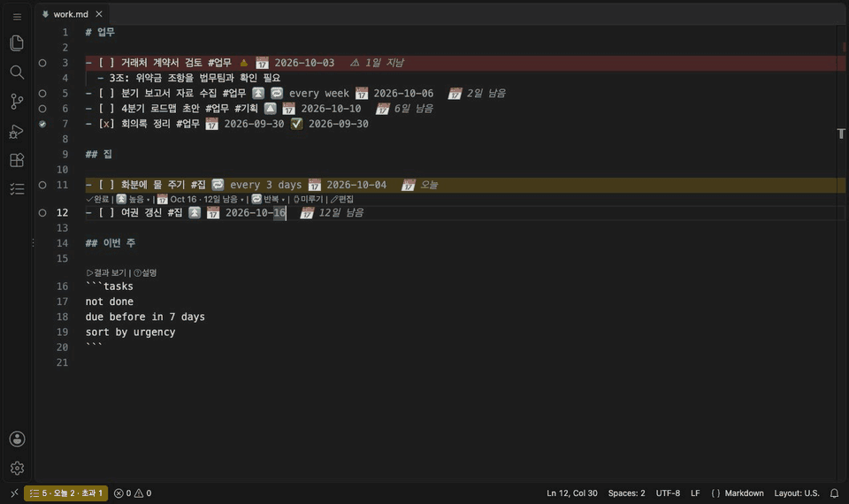
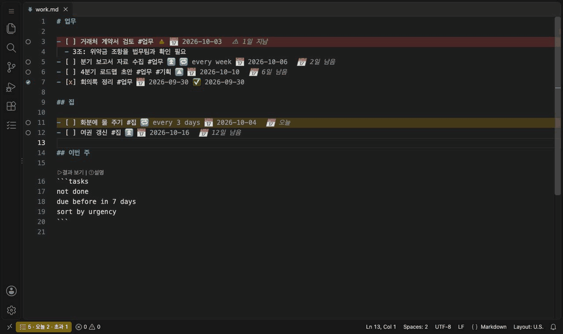
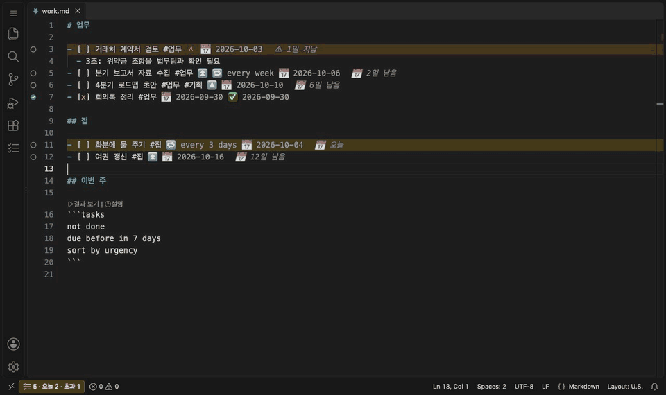
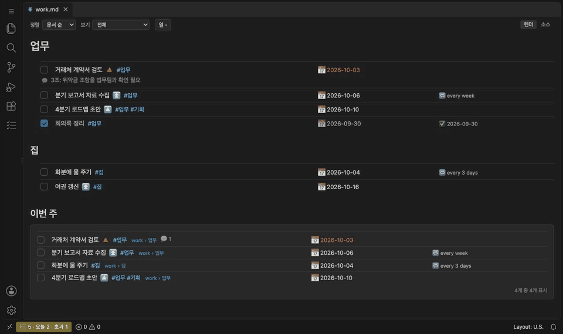
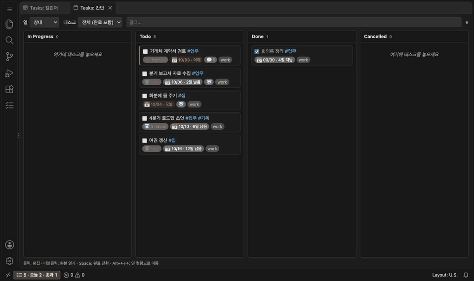
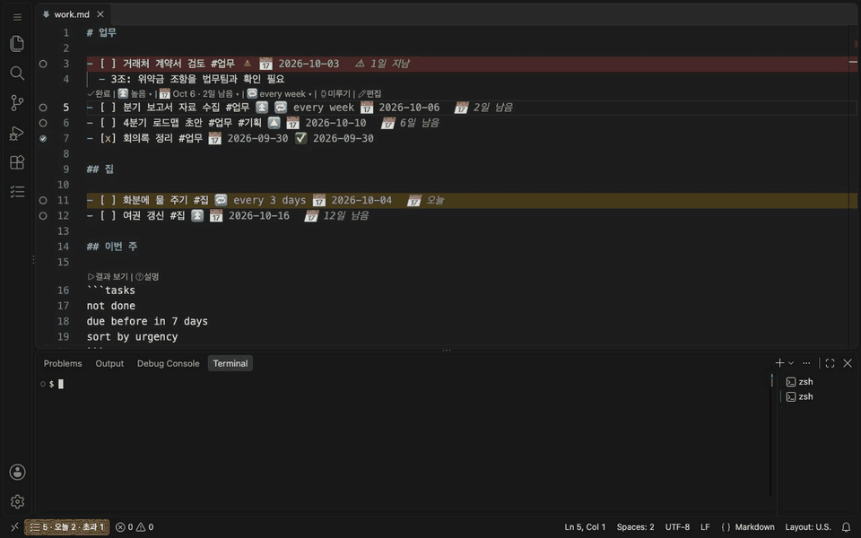

# Tasks for Markdown

[](https://marketplace.visualstudio.com/items?itemName=HastyCapybara.tasks-for-markdown)
[](https://open-vsx.org/extension/HastyCapybara/tasks-for-markdown)
[](https://www.npmjs.com/package/@hastycapybara/tasks-cli)
[](https://www.npmjs.com/package/@hastycapybara/tasks-api)
[](LICENSE)

**VS Code**와 **Cursor**에서 쓰는 Obsidian Tasks 호환 할 일 관리 확장입니다.

[웹사이트](https://hastycapybara.com/apps/tasksmd/) · [README](README.md)

> 이 확장은 Obsidian의 [Tasks 플러그인](https://github.com/obsidian-tasks-group/obsidian-tasks)에서 출발했습니다. 태스크 문법과 쿼리 언어, 그리고 그 프로젝트가 오랫동안 다듬어 온 설계 위에 VS Code·Cursor용으로 다시 만든 것입니다. 좋은 도구를 공개해 준 원작자와 기여자들께 감사드립니다. 아래 [감사의 말](#감사의-말)을 참고하세요.

## 왜 Tasks for Markdown인가

| | |
|---|---|
| **노트는 그냥 마크다운으로 남습니다** | 할 일은 [Obsidian Tasks](https://publish.obsidian.md/tasks/) 문법의 평범한 체크리스트 줄입니다. 별도 데이터베이스도, 종속도 없습니다. 같은 파일을 Obsidian, GitHub, 어떤 편집기에서도 씁니다. |
| **AI 에이전트가 관리해 줍니다** | 내장 [MCP](https://modelcontextprotocol.io) 서버로 Claude Code, Cursor 에이전트, Claude Desktop, VS Code 에이전트 모드가 말로 시킨 대로 태스크를 찾고, 만들고, 완료하고, 메모를 남깁니다. |
| **공개 API로 무엇이든 덧붙일 수 있습니다** | 버전이 정해진 공개 API, 명령, 타입 npm 패키지, CLI, Node 라이브러리를 제공합니다. 다른 확장·스크립트·CI가 같은 태스크를 안전하게 읽고 씁니다. |

```markdown
- [ ] 보고서 작성 #업무 ⏫ 🔁 every week 🛫 2026-09-20 ⏳ 2026-09-22 📅 2026-09-25
  - 재무팀에 3분기 수치 요청
- [x] 회의록 정리 ✅ 2026-09-21
```

확장은 워크스페이스의 모든 `- [ ]` 줄을 인덱싱합니다. 에디터, 사이드바, 칸반 보드, 캘린더, 마크다운 미리보기 어디서든 태스크를 보고, 검색하고, 완료할 수 있습니다. 완료하면 파일의 그 줄이 수정됩니다. 완료일이 붙고, 반복 태스크는 다음 회차가 생깁니다.

## 주요 기능

- **[Obsidian Tasks](https://publish.obsidian.md/tasks/)와 같은 문법** — 이모지·Dataview 필드를 Obsidian과 같은 순서로 써서 파일을 서로 바꿔 써도 됩니다.
- **에디터 보조** — 자연어 날짜(한국어·영어) 자동완성, CodeLens, 호버 카드, 기한 초과 강조, Quick Fix가 있는 진단.
- **사이드바** — 오늘, 예정 7일, 기한 초과, 진행 중, 차단됨, 미완료 전체, 완료. 저장된 쿼리와 그룹별 결과.
- **쿼리 언어** — ` ```tasks ` 블록, 저장된 쿼리, 시각적 쿼리 빌더에서 Obsidian Tasks 쿼리 언어를 그대로 사용.
- **반복·상태·의존성** — `🔁 every month on the last`, 프리셋이 있는 커스텀 상태, `🆔`/`⛔` 의존성과 차단 감지, 긴급도 점수.
- **렌더 보기** — 상호작용 미리보기: 체크, 편집, 미루기, 메모 추가, 열 숨기기, 실시간 쿼리 결과(`Ctrl+Shift+R`).
- **메모** — 태스크 아래 들여쓴 글머리표가 메모입니다. 렌더 보기에서 💬로 바로 남깁니다.
- **추가 뷰** — 만들기/편집 대화상자, 칸반, 캘린더, 주간 통계, 아카이브, 일일 알림.
- **AI와 자동화** — AI 에이전트용 MCP 서버, 공개 확장 API, 명령, CLI, 라이브러리([AI와 함께 쓰기](#ai와-함께-쓰기), [확장하기](#확장하기) 참고).

## 시작하기

처음이라면 [VS Code에서 시작 안내 열기](https://vscode.dev/redirect?url=vscode://hastycapybara.tasks-for-markdown/guide)(Cursor는 명령 팔레트에서 **Tasks: 시작 안내 열기**). 시작 안내는 처음 실행할 때 저절로도 열립니다.

1. **마크다운 파일이 있는 폴더를 엽니다.** 그 안의 모든 `- [ ]` 줄이 태스크가 되고, 액티비티 바에 **Tasks** 아이콘이 생깁니다.
2. **태스크를 만듭니다.** `- [ ] 보고서 작성 📅 2026-09-25`처럼 체크리스트 줄을 쓰거나, `Ctrl+Shift+C`(macOS에서도 Ctrl 키)로 만들기/편집 대화상자를 엽니다. 태스크 줄에서 `Ctrl+Shift+Enter`를 누르면 완료됩니다.
3. **쿼리 블록으로 거르고, 노트를 렌더링해 봅니다.** ` ```tasks ` 블록은 조건에 맞는 태스크를 목록으로 보여 줍니다. `Ctrl+Shift+R`을 누르면 노트가 렌더 보기로 열리고 그 자리에 결과가 나옵니다. (VS Code 기본 마크다운 미리보기에도 결과가 보이지만 체크박스는 표시 전용입니다.) 자주 쓰는 쿼리 줄: [쿼리 문법](#쿼리-문법).

````markdown
```tasks
not done
due before next week
sort by urgency
group by filename
```
````

## 예시

**도움을 받으며 입력.** 입력하는 동안 자동완성이 필드를 제안하고, `다음 금요일`·`next fri` 같은 자연어 날짜가 실제 날짜로 바뀝니다.



**대화상자로 만들고 고치기.** 빈 줄에서 `Ctrl+Shift+C`를 누르면 새 태스크 입력 창이 열립니다. 기존 태스크 위에서 누르면 같은 창으로 그 태스크를 고칩니다. 우선순위, 말로 쓰는 날짜, 태그, 반복을 한 번에 정합니다.



**키 하나로 완료.** `Ctrl+Shift+Enter`로 완료합니다. 반복 태스크는 다음 회차가 자동으로 생깁니다.



**렌더 보기에서 작업.** 체크박스를 누르고, 💬로 메모를 남기고, 열을 숨기거나 다시 보입니다. 쿼리 블록이 바로 갱신됩니다.



**보드와 달력으로 계획.** 카드를 상태 열 사이로 끌어 옮기고, 태스크를 다른 날로 끌어 일정을 바꿉니다.



## AI와 함께 쓰기

Tasks for Markdown에는 [MCP](https://modelcontextprotocol.io) 서버가 들어 있어서, MCP를 쓰는 AI 에이전트라면 어느 것이든 태스크를 도구로 읽고 고칠 수 있습니다. Claude Code, Cursor 에이전트, VS Code 에이전트 모드, Claude Desktop이 그렇습니다. VS Code와 Cursor에서는 확장을 설치하는 순간 연결되고, 그다음부터 말로 시키면 됩니다. 아래 화면은 실제 Claude Code 실행 장면입니다. 에이전트가 일하는 동안 에디터의 노트가 바로 바뀝니다.



**연결** — 따로 설치할 것이 없습니다. 서버는 에디터에 내장된 Node로 돌아갑니다.

- **VS Code(에이전트 모드)와 Cursor:** 확장을 설치하면 자동으로 연결됩니다. 워크스페이스 폴더마다 서버 하나(`tasksmd.mcp.autoRegister`, 기본 켬, 신뢰되지 않은 워크스페이스에서는 안 함).
- **Claude Code와 Claude Desktop:** 명령 **Tasks: AI 에이전트 연결 (MCP)**을 실행하고 고르세요. Claude Code는 이 컴퓨터의 이 프로젝트에만 추가하고(`claude mcp add-json --scope local`), Claude Desktop은 확인을 받은 뒤 설정 파일을 고칩니다(원본 백업, 다른 서버는 그대로. Claude Desktop은 먼저 완전히 종료하세요 — 켜져 있으면 옛 설정을 다시 씁니다). 설치됐는데 연결되지 않았으면 확장이 켜질 때 연결을 권합니다. Claude Desktop은 도구를 쓸 때마다 허용을 묻는데, 조회는 커넥터 설정(`+` → 커넥터 → 커넥터 관리 → tasks)에서 읽기 도구를 *항상 허용*으로 두면 묻지 않습니다.

<details>
<summary>확장 없이(다른 컴퓨터, CI): npm 패키지</summary>

서버를 npm에서 `npx`로 실행하므로 Node.js 18 이상이 필요합니다.

```bash
# Claude Code, 노트 폴더에서
claude mcp add tasks -- npx -y @hastycapybara/tasks-cli mcp --root "$PWD"
```

Cursor — `.cursor/mcp.json`:
```json
{ "mcpServers": { "tasks": { "command": "npx", "args": ["-y", "@hastycapybara/tasks-cli", "mcp", "--root", "${workspaceFolder}"] } } }
```

VS Code(에이전트 모드) — `.vscode/mcp.json`:
```json
{ "servers": { "tasks": { "type": "stdio", "command": "npx", "args": ["-y", "@hastycapybara/tasks-cli", "mcp", "--root", "${workspaceFolder}"] } } }
```

Claude Desktop — `claude_desktop_config.json`, 노트 폴더의 절대 경로로:
```json
{ "mcpServers": { "tasks": { "command": "npx", "args": ["-y", "@hastycapybara/tasks-cli", "mcp", "--root", "/path/to/notes"] } } }
```
</details>

**이렇게 말해 보세요:**
- "기한 지난 거 뭐 있어? 거래처 계약 검토는 완료로 하고 '법무팀이 3조 승인'이라고 메모 남겨 줘."
- "이번 주 계획 세워 줘. 일요일 전에 마감인 것을 긴급한 순서로."
- "오늘 마감인 #home 태스크를 전부 토요일로 미뤄 줘."
- "여권 갱신 태스크 만들어 줘. 우선순위 높음, 마감 다음 주 금요일."

**에이전트가 할 수 있는 일:** 쿼리 언어 전체로 검색, 태스크 조회·생성, 필드 변경, 상태 변경, 미루기, 메모 추가, 삭제, 쿼리 설명. 에이전트는 먼저 문법 안내를 읽으므로 올바른 Obsidian Tasks 문법으로 씁니다. 모든 쓰기에는 읽어 간 줄의 내용이 함께 실리고, 그 사이 줄이 바뀌었으면 쓰기를 거절합니다. 그래서 옛 내용을 보고 일하는 에이전트가 사용자의 수정을 덮어쓰지 않습니다. 전체 도구 목록: [MCP 서버](docs/api.md).

## 터미널에서 쓰기

**Tasks: 'tasksmd' 터미널 명령 설치**(또는 시작 안내의 버튼)를 실행하면 어느 터미널에서든 `tasksmd` 명령을 쓸 수 있습니다. Node.js나 npm은 필요 없습니다. 에디터 내장 Node로 돌아가고 확장과 함께 업데이트됩니다.

- **에디터를 열지 않고 확인:** 오늘 마감, 기한 지난 것, 다음 할 일.
- **빠르게 고치기:** 추가, 완료, 미루기, 메모.
- **스크립트와 자동화:** 매일 아침 요약, 출시 태스크가 밀리면 경고하는 git hook, Raycast·Alfred·단축어 동작. `--json`으로 `jq` 같은 도구와 연결.
- **터미널 AI:** Claude Code, Codex처럼 셸 명령을 실행하는 AI가 바로 씁니다.
- **에디터와 같은 규칙:** Obsidian Tasks 문법, 완료일, 반복 태스크의 다음 회차, 내 설정을 그대로 따릅니다. `--expect`를 주면 그 사이 바뀐 줄은 고치지 않습니다.

```bash
tasksmd query "not done
due before today
sort by due"                                                   # 기한 지난 것
tasksmd add "- [ ] 은행에 전화 📅 2026-10-08" --file inbox.md      # 추가(파일이 없으면 만듦)
tasksmd postpone inbox.md:1 "next monday"                       # 줄 번호는 1부터
tasksmd done inbox.md:1                                         # 완료일, 다음 회차
tasksmd query "due today" --json | jq '.matched'
```

## 확장하기

Tasks for Markdown은 그 위에 무언가를 만들 수 있게 설계했습니다. 다른 확장, 단축키, 스크립트, CI가 **버전이 정해진 안정적인 공개 API**로 같은 태스크를 다룹니다. 마크다운을 직접 파싱할 필요가 없습니다.

**만들 수 있는 것:**
- 태스크가 *진행 중*으로 바뀌면 타이머를 켜는 시간 기록기 (`events.onDidChangeStatus`)
- 기한 지난 일을 보여 주는 상태 표시줄 카운터나 대시보드 (`query.run` + `events.onDidChangeTasks`)
- 완료한 태스크를 팀 채팅에 올리거나 이슈를 닫는 연결 (`events.onDidCompleteTask`)
- 출시 태스크가 기한을 넘기면 빌드를 실패시키는 CI 일일 보고 (CLI)
- 같은 인덱스 위에 올린 나만의 화면: 타임라인, 집중 목록, 회고

```ts
import type { TasksExtensionExports } from '@hastycapybara/tasks-api';

const ext = vscode.extensions.getExtension<TasksExtensionExports>('HastyCapybara.tasks-for-markdown');
const tasks = (await ext!.activate()).getAPI(1, { extensionId: 'me.my-extension' });

const r = await tasks.query.run('not done\ndue before tomorrow\nsort by urgency');
tasks.events.onDidChangeStatus(({ before, after }) => console.log(after.description, before.status.name, '→', after.status.name));
if (tasks.features?.includes('notes.add')) await tasks.edit.addNote(r.tasks[0], 'Started');
```

| 제공 방식 | 대상 | |
|---|---|---|
| 확장 API `getAPI(1)` | 다른 VS Code/Cursor 확장 | `query`, `edit`(create, update, setStatus, postpone, addNote, batch…), `events`, `ui`, `features` / `info()`로 기능 확인 |
| 명령 `tasksmd.api.*` | 단축키, 매크로, 다른 언어로 만든 확장 | API의 모든 메서드를 JSON 인자를 받는 명령으로 |
| [`@hastycapybara/tasks-api`](https://www.npmjs.com/package/@hastycapybara/tasks-api) | TypeScript | 타입 정의만(실행 코드 없음) |
| `tasksmd` 명령 | 터미널, 스크립트, AI 에이전트 | `tasksmd query`, `add`, `done`, `note`, `info` … 와 MCP 서버. **Tasks: 'tasksmd' 터미널 명령 설치**로 확장에서 바로 설치(npm 불필요). 에디터가 없는 컴퓨터에서는 [`@hastycapybara/tasks-cli`](https://www.npmjs.com/package/@hastycapybara/tasks-cli) |
| 태스크 링크 | 다른 앱, 채팅, AI 답변 | `<scheme>://hastycapybara.tasks-for-markdown/open?path=…&line=…`, `/query?text=…`. `ui.link(ref)`로 만듦 |
| [`@hastycapybara/tasks-core`](https://www.npmjs.com/package/@hastycapybara/tasks-core) | Node 프로그램 | 파서, 쿼리 엔진, 반복 계산을 라이브러리로 |

기능은 추가만 되고 API 버전은 `1`로 유지되므로, 만든 확장은 업데이트 후에도 그대로 동작합니다. 쓰기는 기본적으로 호출자마다 한 번 확인받고(`tasksmd.api.writePolicy`), 오류는 `{ code, message }` 형태이며, 옛 내용으로 쓰려 하면 거절됩니다. [공개 API 문서](docs/api.md)를 참고하세요.

## 쿼리 문법

` ```tasks ` 블록에는 한 줄에 하나씩 조건을 씁니다. 결과에 나오려면 모든 필터 줄을 만족해야 합니다(줄끼리는 AND). [Obsidian Tasks 쿼리 언어](https://publish.obsidian.md/tasks/Queries/About+Queries)와 같아서, 같은 블록이 Obsidian에서도 동작합니다.

| 용도 | 쓸 수 있는 줄 |
|---|---|
| 상태 | `not done` · `done` · `status.type is IN_PROGRESS` |
| 날짜 | `due today` · `due before tomorrow` · `due this week` · `due next week` · `happens on or before today` · `done after last week` · `no due date` · `has due date` |
| 우선순위 | `priority is high` · `priority is above medium` |
| 글·태그·파일 | `tags include #업무` · `description includes 보고서` · `path includes projects` · `heading includes 오늘` |
| 반복·의존 | `is recurring` · `is blocked`(미완료 태스크를 기다리는 중) · `is blocking`(미완료 태스크가 이것을 기다림) |
| 조합 | `(due today) OR (priority is high)` · `NOT (tags include #집)` · 괄호와 함께 `AND`, `OR`, `NOT`, `XOR` |
| 정렬·그룹 | `sort by urgency` · `sort by due reverse` · `group by filename` · `group by tags` · `limit 20` |
| 표시 | `hide due date` · `short mode` · `show tree` / `hide tree`(하위 태스크를 부모 밑에, 기본 켜짐) · `explain` |

날짜에는 `today`, `next friday`, `in 2 weeks` 같은 말, `this month`, `2026-W40` 같은 기간, 정확한 날짜를 씁니다. 쿼리 줄은 영어로 씁니다. 전체 문법은 Obsidian Tasks 문서의 [필터](https://publish.obsidian.md/tasks/Queries/Filters), [정렬](https://publish.obsidian.md/tasks/Queries/Sorting), [그룹](https://publish.obsidian.md/tasks/Queries/Grouping)을, 이 확장만의 차이(트리 표시 등)는 [사용자 가이드 4장](docs/user-guide.md#4-쿼리)을 보세요.

쿼리를 직접 쓰지 않아도 됩니다. `Tasks: 쿼리 빌더 열기`는 드롭다운으로 쿼리를 만들고 맞는 개수를 바로 보여 줍니다. 블록 위 CodeLens `설명`은 각 줄을 어떻게 이해했는지 보여 줍니다.

## 명령 (명령 팔레트 → "Tasks:")

| 명령 | 단축키 |
|---|---|
| 태스크 완료 토글 | `Ctrl+Shift+Enter` (태스크 줄에서, macOS에서도 Ctrl) |
| 태스크 만들기 / 편집 | `Ctrl+Shift+C` |
| 렌더 보기로 열기 / 마크다운 소스 편집 (전환) | `Ctrl+Shift+R` |
| 렌더 보기를 기본 편집기로 (설정/해제) | — |
| 태스크 빠른 검색 | `Cmd/Ctrl+Shift+;` |
| 상태 / 우선순위 / 마감일 / 예정일 / 시작일 / 반복 / 의존성 설정, 미루기 | — |
| 칸반 보드 / 캘린더 / 통계 / 쿼리 빌더 열기 | — |
| 완료 태스크 아카이브… | — |
| 쿼리 블록 삽입, 커서 위치 쿼리 결과 보기(에디터 옆 패널, 커서 따라가기), 커서 위치 쿼리 설명 | — |
| AI 에이전트 연결 (MCP), 'tasksmd' 터미널 명령 설치 / 제거, 시작 안내 열기 | — |
| 태스크 링크 복사, 커서 위치 쿼리 링크 복사(링크를 누르면 어느 앱에서든 그 태스크가 열림: `vscode://hastycapybara.tasks-for-markdown/open?…`) | — |
| 상태 프리셋 불러오기…, 이 파일의 태스크 포맷 변환… | — |

## 설정 (`tasksmd.*`)

| 설정 | 기본값 | 설명 |
|---|---|---|
| `taskFormat` | `emoji` | 필드를 쓸 때 사용할 포맷 (`emoji` / `dataview`) |
| `globalFilter` | `""` | 이 문자열(예: `#task`)이 있는 줄만 태스크로 취급 |
| `language` | `auto` | 확장 화면 언어(`auto`, `en`, `ko`). 에디터 표시 언어와 따로 정할 수 있음 |
| `mcp.autoRegister` | `true` | 확장에 들어 있는 MCP 서버를 이 에디터의 AI 에이전트(VS Code 에이전트 모드, Cursor)에 폴더마다 자동 등록. 신뢰되지 않은 워크스페이스에서는 안 함 |
| `removeGlobalFilterFromDescription` | `true` | 설명을 보여 줄 때 글로벌 필터 문자열(예: `#task`)을 숨김. 파일은 그대로 |
| `include` / `exclude` / `respectGitignore` / `maxFileSizeKB` | | 스캔 범위 |
| `setDoneDate` / `setCancelledDate` / `setCreatedDate` | `true` / `true` / `false` | ✅ ❌ ➕ 자동 날짜 |
| `statuses` | 기본 4종 | 커스텀 체크박스 심볼·이름·다음 심볼·타입 |
| `recurrence.insertPosition` / `idHandling` / `copyDependsOn` / `removeScheduledDate` | `above` / `keep` / `true` / `false` | 다음 회차 생성 규칙 |
| `decorations.*`, `codeLens.mode`, `autoSuggest.*` | | 에디터 보조 |
| `preview.enabled` / `preview.renderBadges` | `true` | 마크다운 미리보기 렌더링 |
| `savedQueries` | `[]` | 저장된 쿼리 (`.tasks/queries/*.md`도 함께 읽음) |
| `query.allowFunctions` | `false` | 쿼리의 `by function` JavaScript 허용 (신뢰된 워크스페이스만) |
| `editModal.accessKeys` / `editModal.hiddenFields` | `true` / `[]` | 편집 대화상자 |
| `notifications.*` | 켜짐, `09:00`, 1일 | 일일 요약·마감 임박 알림, OS 알림 |
| `archive.file` / `afterDays` / `linkStyle` | `Archive.md` / 30 / `wiki` | 아카이브 명령 |
| `calendar.newTaskFile` | `""` | 캘린더에서 만든 태스크를 넣을 파일 |
| `query.showTree` | `true` | 쿼리 결과를 트리로(하위 태스크를 부모 밑에). 블록별 `show tree` / `hide tree` |
| `decorations.strikeCancelled` | `true` | 취소된 태스크(`[-]`)에 에디터 취소선. 완료(`[x]`)는 `decorations.strikeDone`(기본 꺼짐) |
| `requireDueDate` | `true` | 마감일 없는 새 태스크 거부(대화상자·API·CLI·MCP) + 에디터 경고 |
| `api.writePolicy` | `confirm` | 다른 확장이 API로 쓸 때: 확인(`confirm`) / 허용 / 거부 |
| `api.allowedWriters` / `api.batchLimit` | `[]` / `200` | 묻지 않고 API로 쓸 수 있는 확장 목록(확인 대화상자가 채움), API batch 한 번에 허용하는 최대 작업 수 |
| `rendered.maxWidth` | `0` | 렌더 보기 본문 열 최대 폭(px). 0 = 창 전체 폭(기본). 800 등을 주면 가운데 열로 제한 |
| `rendered.sourceWhenNoTasks` | `true` | 렌더 보기가 기본 편집기일 때 태스크 없는 노트는 텍스트 편집기로 |
| `rendered.fieldsAlign` | `columns` | 렌더 보기 태스크 줄의 필드 배치: 열(`columns`: 상태·설명+우선순위+태그·마감·작성일·나머지) / 오른쪽 끝(`right`) / 설명 뒤(`inline`) |
| `rendered.fontSize` / `rendered.lineHeight` | `14.5` / `1.6` | 렌더 보기 본문 글자 크기(px)와 줄 간격 |
| `rendered.fieldStyle` | `plain` | 렌더 보기 태스크 줄의 필드 표시: 원문처럼(`plain`) / 배지(`badges`) |
| `calendar.fontSize` | `13` | 캘린더 칸의 태스크 글자 크기(px) |
| `calendar.fullScreen` | `maximize` | 전체 화면 버튼: 에디터 그룹 최대화만(`maximize`) / 창도 전체 화면(`window`) |
| `updateCheckUrl` | `""` | `.vsix` 설치본용 `latest.json` 위치 |

## 문서

- [사용자 가이드](docs/user-guide.md) · [의존성(🆔/⛔) 이해하기](docs/dependencies-guide.md) · 편집기 밖에서는 [npm 라이브러리 `@hastycapybara/tasks-core`](packages/core/README.md)와 [CLI `tasksmd`](packages/cli/README.md)(MCP 서버 포함, Claude Code 연동은 docs/api.md 8절)
- [요구사항](docs/requirements.md) · [설계](docs/design.md) · [개발 체크리스트](docs/Tasks.md) · [성능](docs/perf.md) · [릴리스 절차](docs/release.md) · [배포 가이드라인](docs/publishing-guide.md) · [실패 기록(포스트모템)](docs/postmortems/README.md) · [공개 전 내부 개발 이력](docs/history-internal.md) · [수동 점검·사용자 작업 안내](docs/manual-checklist.md) · [공개 API](docs/api.md) · [API 계획](docs/api-plan.md)

## 개발

```bash
pnpm install
pnpm build              # 확장 + 웹뷰 번들
pnpm test               # 단위 테스트 (vitest)
pnpm test:integration   # VS Code를 띄워 통합 테스트
pnpm package            # production 빌드 + .vsix + latest.json
```

VS Code/Cursor에서 `F5`를 누르면 확장이 로드된 개발용 창이 열립니다.

## 감사의 말

이 확장은 [Obsidian Tasks](https://github.com/obsidian-tasks-group/obsidian-tasks)가 없었다면 존재하지 않았습니다. 태스크 문법, 쿼리 언어, 핵심 로직 일부(파서, 반복, 긴급도)를 그 프로젝트에서 이식했고(MIT 라이선스), 기능 하나하나의 동작도 그 문서를 기준으로 맞췄습니다. 플러그인을 처음 만든 Martin Schenck, 오랫동안 이끌어 온 Clare Macrae, 그리고 모든 기여자께 깊이 감사드립니다.

- Obsidian을 쓰신다면 원본 플러그인을 써 보세요: [Tasks 문서](https://publish.obsidian.md/tasks/) · [저장소](https://github.com/obsidian-tasks-group/obsidian-tasks)
- 원본 프로젝트를 후원할 수 있습니다: [GitHub Sponsors (Clare Macrae)](https://github.com/sponsors/claremacrae)
- 이식한 코드와 라이선스 고지는 [NOTICE.md](NOTICE.md)에 있습니다.
- 라이선스: [THIRD_PARTY_NOTICES.md](THIRD_PARTY_NOTICES.md)

이 프로젝트는 Obsidian Tasks 프로젝트나 Obsidian(Dynalist Inc.)과 관련이 없으며, 그들의 보증을 받지 않았습니다.

## 라이선스

MIT
