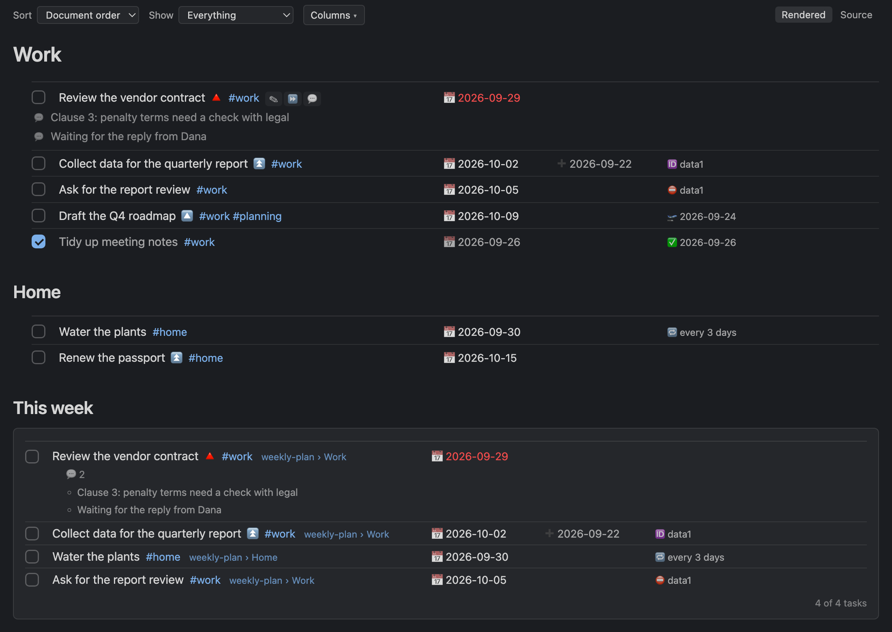

# Tasks for Markdown

Obsidian Tasks-compatible task management for Markdown files in **VS Code** and **Cursor**. (한국어: [README.ko.md](README.ko.md))

> This extension started from the [Tasks plugin](https://github.com/obsidian-tasks-group/obsidian-tasks) for Obsidian. It rebuilds that plugin's task syntax, query language and years of careful design for VS Code and Cursor. Thank you to its authors and contributors — see [Credits](#credits).

Your tasks stay in your notes as plain checklist lines — no database, no lock-in:

```markdown
- [ ] Write the report #work ⏫ 🔁 every week 🛫 2026-09-20 ⏳ 2026-09-22 📅 2026-09-25
- [x] Tidy meeting notes ✅ 2026-09-21
```

The extension indexes every `- [ ]` line in the workspace and lets you see, query and complete tasks wherever you are: the editor, a sidebar, a kanban board, a calendar, the Markdown preview. Completing a task rewrites the line in the file (with a done date, and the next instance for recurring tasks).



## Highlights

- **Same syntax as [Obsidian Tasks](https://publish.obsidian.md/tasks/)** — emoji fields (📅 ⏳ 🛫 ➕ ✅ ❌ 🔁 🏁 🆔 ⛔, priorities 🔺⏫🔼🔽⏬) and Dataview inline fields (`[due:: 2026-09-25]`) are both read; you choose which one is written. Lines are written in Obsidian's exact field order, so files stay interchangeable.
- **Editor assistance** — auto-suggest on task lines (`due`, `priority high`, `every week`, natural-language dates like `next fri` / `3일 후`), CodeLens actions above the current task, hover cards, relative-date hints, overdue highlighting, diagnostics with quick fixes.
- **Sidebar** — Today / Next 7 days / Overdue / In progress / Blocked / All open / Done, grouping, filter, checkboxes; saved queries with grouped results.
- **Query language** — the Obsidian Tasks query language in ` ```tasks ` blocks (rendered in the Markdown preview), in saved queries and in a visual query builder. Filters, boolean logic, sort by, group by, limits, layout options, `explain`, and optional `filter/sort/group by function`.
- **Recurrence, statuses, dependencies** — `🔁 every month on the last`, `when done`, custom checkbox statuses with theme presets (Minimal, ITS, Things), `🆔`/`⛔` dependencies with blocked detection and cycle diagnostics, Obsidian's urgency score.
- **Rendered view** — an interactive preview of the note: click checkboxes, double-click to edit, hover a task for ✎ edit · ⏩ postpone · 💬 note, follow links, and see ` ```tasks ` results in place. Tasks line up in columns (status · description · due · created · other fields); hide or resize columns from the column header or the `Columns ▾` menu, and sort or narrow the view (due, created, urgency; today, this week, next week) without touching the file (`Ctrl+Shift+R`). Make it the default editor for `.md` with the `Tasks: Rendered view as default editor` command — in Cursor it replaces the built-in Preview toggle.
- **Notes** — indented plain bullets under a task are its notes (Obsidian-compatible). Add one from the rendered view with `💬`, see `💬 2` on query rows and cards, edit them in the dialog's More section.
- **More views** — Create/edit dialog, kanban (drag & drop), calendar (month/week, full screen, drag to reschedule), weekly statistics, archive of completed tasks, daily notifications.
- **Works in Cursor** — only stable VS Code APIs; also published to Open VSX.

## Getting started

1. Install the extension (Marketplace / Open VSX / `.vsix`).
2. Open a folder with Markdown files. The **Tasks** icon appears in the Activity Bar.
3. Put the cursor on a checklist line and press `Ctrl+Shift+Enter` (the Ctrl key on macOS too) to toggle it, or `Ctrl+Shift+C` to open the edit dialog.
4. Type ` ```tasks ` in a note and open the Markdown preview:

````markdown
```tasks
not done
due before next week
sort by urgency
group by filename
```
````

## Commands (Command Palette → "Tasks:")

| Command | Default key |
|---|---|
| Toggle task done | `Ctrl+Shift+Enter` (on a task line; Ctrl on macOS too) |
| Create or edit task | `Ctrl+Shift+C` |
| Quick search tasks | `Cmd/Ctrl+Shift+;` |
| Set status / priority / due / scheduled / start / recurrence / dependencies, Postpone | — |
| Open rendered view / edit Markdown source (toggle) — interactive preview with live ```tasks results | `Ctrl+Shift+R` |
| Rendered view as default editor (on/off) | — |
| Open kanban board / calendar / statistics / query builder / query results (beside the editor, follows the cursor) | — |
| Archive completed tasks… | — |
| Insert query block, Explain query under cursor | — |
| Load status preset…, Convert task format in this file… | — |

## Settings (`tasksmd.*`)

| Setting | Default | What it does |
|---|---|---|
| `taskFormat` | `emoji` | Format used when writing fields (`emoji` or `dataview`) |
| `globalFilter` | `""` | Only lines containing this text (e.g. `#task`) are tasks |
| `include` / `exclude` / `respectGitignore` / `maxFileSizeKB` | | What gets scanned |
| `setDoneDate` / `setCancelledDate` / `setCreatedDate` | `true` / `true` / `false` | Automatic ✅ ❌ ➕ dates |
| `statuses` | 4 core statuses | Custom checkbox symbols, names, next symbol and type |
| `recurrence.insertPosition` / `idHandling` / `copyDependsOn` / `removeScheduledDate` | `above` / `keep` / `true` / `false` | Next-instance behaviour |
| `decorations.*`, `codeLens.mode`, `autoSuggest.*` | | Editor assistance |
| `preview.enabled` / `preview.renderBadges` | `true` | Markdown preview rendering |
| `savedQueries` | `[]` | Saved queries (also `.tasks/queries/*.md`) |
| `query.allowFunctions` | `false` | Allow `by function` JavaScript in queries (trusted workspaces only) |
| `editModal.accessKeys` / `editModal.hiddenFields` | `true` / `[]` | Edit dialog |
| `notifications.*` | on, `09:00`, 1 day | Daily summary and due-soon digest, OS notifications |
| `archive.file` / `afterDays` / `linkStyle` | `Archive.md` / 30 / `wiki` | Archive command |
| `calendar.newTaskFile` | `""` | File that receives tasks created from the calendar |
| `query.showTree` | `true` | Query results as a tree (sub-tasks under their parent); per block `show tree` / `hide tree` |
| `decorations.strikeCancelled` | `true` | Strike through cancelled tasks (`[-]`) in the editor; done tasks use `decorations.strikeDone` (off) |
| `requireDueDate` | `true` | Refuse new tasks without a due date (dialog, API, CLI, MCP) and warn in the editor |
| `api.writePolicy` | `confirm` | Writes through the public API: confirm once per caller / allow / deny |
| `rendered.maxWidth` | `0` | Max width (px) of the rendered column; 0 = full editor width (default) |
| `rendered.sourceWhenNoTasks` | `true` | With the rendered view as default editor, notes without tasks open in the text editor |
| `rendered.fieldsAlign` | `columns` | Rendered view: fields in aligned columns (`columns`: status, description+priority+tags, due, created, everything else), at the right edge (`right`) or after the description (`inline`) |
| `rendered.fontSize` / `rendered.lineHeight` | `14.5` / `1.6` | Rendered view body font size (px) and line height |
| `rendered.fieldStyle` | `plain` | Task-line fields in the rendered view: as in the source (`plain`) or pill badges (`badges`) |
| `calendar.fontSize` | `13` | Font size (px) of tasks in calendar cells |
| `calendar.fullScreen` | `maximize` | Full screen button: maximize the editor group only, or `window` for the whole window |
| `updateCheckUrl` | `""` | `latest.json` location for `.vsix` installs |

## API and automation

Four ways for other programs to read and write tasks. Details in [docs/api.en.md](docs/api.en.md).

| From | How |
|---|---|
| Another VS Code/Cursor extension | `getExtension('HastyCapybara.tasks-for-markdown').exports.getAPI(1, { extensionId })` → `query.run(...)`, `edit.setStatus(...)`, `edit.addNote(...)`. For types, copy the self-contained file [src/api/types.ts](src/api/types.ts) |
| Keybindings, macros | Commands `tasksmd.api.<ns>.<method>` (e.g. `tasksmd.api.query.run` with `{ "query": "due today" }`) |
| Terminal, scripts, CI | `npx @hastycapybara/tasks-cli query "not done\ndue before today" --root ~/notes` — no editor needed |
| AI agents (Claude Code, Cursor, …) | `claude mcp add tasks -- npx -y @hastycapybara/tasks-cli mcp --root "$PWD"`, then ask in plain language |

```ts
// from another extension
const tasks = (await ext.activate()).getAPI(1, { extensionId: 'my.extension' });
const r = await tasks.query.run('not done\nhappens on or before today');   // same as the sidebar's "Today"
await tasks.edit.setStatus({ path: r.tasks[0].path, line: r.tasks[0].line, expectedText: r.tasks[0].originalMarkdown }, 'x');
```

Writes ask the user once per caller by default (`tasksmd.api.writePolicy`). Everything is plain JSON; errors are `{ code, message }`. Notes and dependencies (`isBlocked` / `isBlocking`) work through the extension API, the CLI and MCP alike. By default new tasks need a due date; check the installed version's features and settings with `info()` (CLI `tasksmd info`, MCP `tasks_info`). Need only the Node library? `@hastycapybara/tasks-core`.

## Notes on the Markdown preview

The built-in preview renders task lines with checkboxes and badges and ` ```tasks ` blocks as live results, refreshed whenever tasks change. The classic preview cannot send clicks back to extensions, so checkboxes there are display-only — toggle tasks from the editor, the sidebar or the kanban board instead.

## Documentation

- [Public API (extension API, commands, library, CLI, MCP server)](docs/api.en.md)

- [User guide (Korean)](docs/user-guide.md)
- [Requirements](docs/requirements.md) · [Design](docs/design.md) · [Development checklist](docs/Tasks.md) · [Performance](docs/perf.md)

## Development

```bash
pnpm install
pnpm build              # extension + webview bundles
pnpm test               # unit tests (vitest)
pnpm test:integration   # runs a VS Code instance
pnpm package            # production build + .vsix + latest.json
```

Press `F5` in VS Code to launch an Extension Development Host.

## Credits

This extension would not exist without [Obsidian Tasks](https://github.com/obsidian-tasks-group/obsidian-tasks). The task syntax, the query language and parts of the core logic (parser, recurrence, urgency) are ported from it (MIT license), and its documentation is the reference for how each feature behaves. Many thanks to Martin Schenck, who created the plugin, Clare Macrae, who has led it for years, and every contributor.

- If you use Obsidian, try the original plugin: [Tasks documentation](https://publish.obsidian.md/tasks/) · [repository](https://github.com/obsidian-tasks-group/obsidian-tasks)
- You can support the original project: [GitHub Sponsors (Clare Macrae)](https://github.com/sponsors/claremacrae)
- Ported code and license notices: [NOTICE.md](NOTICE.md)

This project is not affiliated with or endorsed by the Obsidian Tasks project or Obsidian (Dynalist Inc.).

## License

MIT
