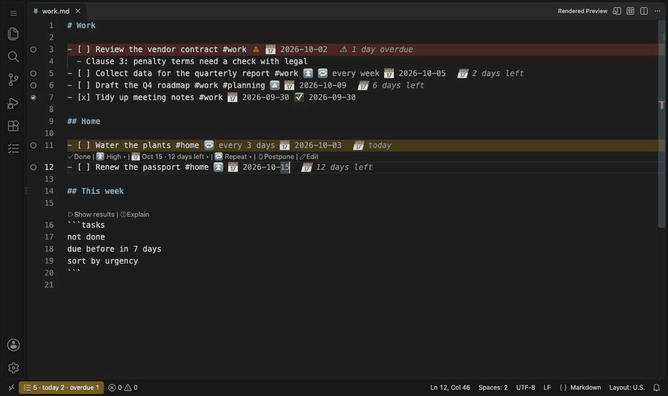
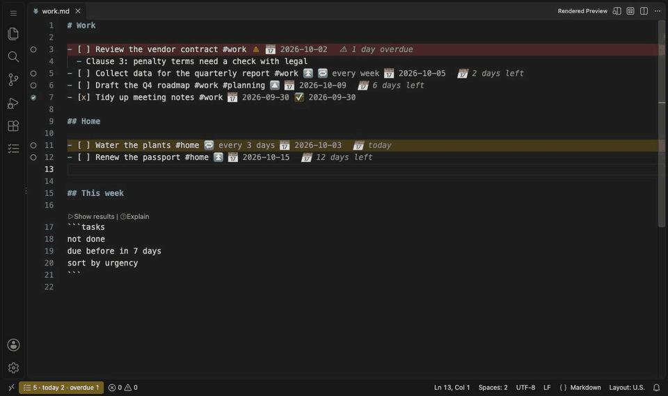
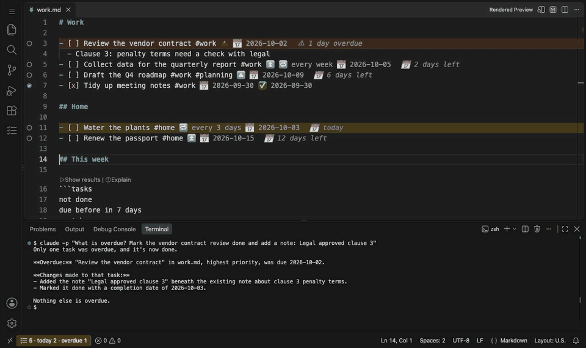
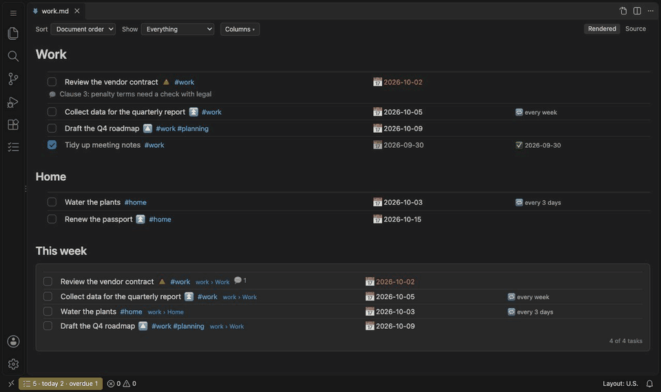
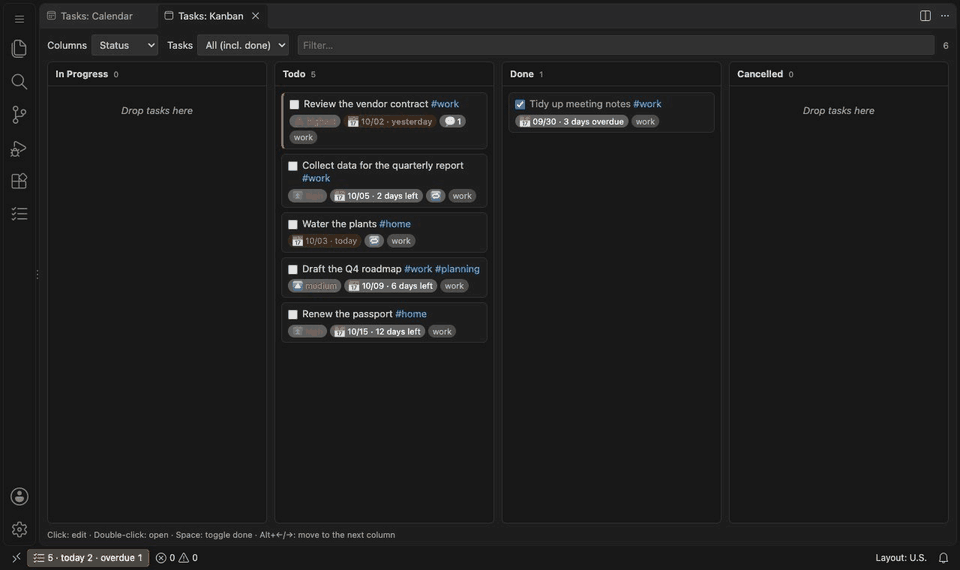
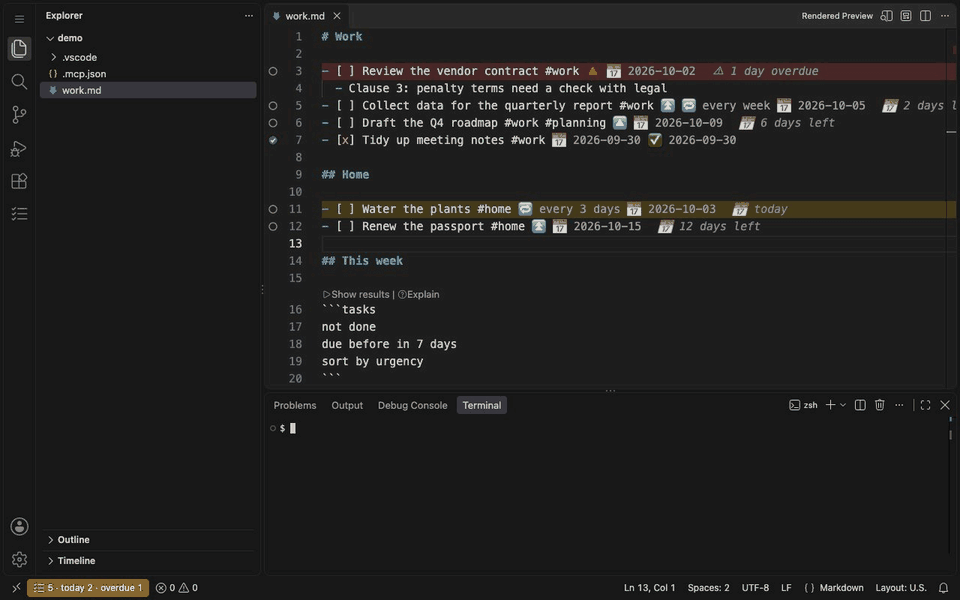

# Tasks for Markdown

[](https://marketplace.visualstudio.com/items?itemName=HastyCapybara.tasks-for-markdown)
[](https://open-vsx.org/extension/HastyCapybara/tasks-for-markdown)
[](https://www.npmjs.com/package/@hastycapybara/tasks-cli)
[](https://www.npmjs.com/package/@hastycapybara/tasks-api)
[](LICENSE)

Obsidian Tasks-compatible task management for Markdown files in **VS Code** and **Cursor**.

[Website](https://hastycapybara.com/apps/tasksmd/) · [Korean README](README.ko.md)

> This extension started from the [Tasks plugin](https://github.com/obsidian-tasks-group/obsidian-tasks) for Obsidian. It rebuilds that plugin's task syntax, query language and years of careful design for VS Code and Cursor. Thank you to its authors and contributors — see [Credits](#credits).

## Why Tasks for Markdown

| | |
|---|---|
| **Your notes stay plain Markdown** | Tasks are ordinary checklist lines in the [Obsidian Tasks](https://publish.obsidian.md/tasks/) syntax — no database, no lock-in. The same files work in Obsidian, on GitHub and in any editor. |
| **Your AI agent can manage them** | A built-in [MCP](https://modelcontextprotocol.io) server lets Claude Code, Cursor's agent, Claude Desktop or VS Code's agent mode query, create, complete and annotate tasks when you ask in plain language. |
| **Other tools can build on it** | A versioned public API, a command surface, a typed npm package, a CLI and a Node library. Other extensions, scripts and CI jobs read and write the same tasks safely. |

```markdown
- [ ] Write the report #work ⏫ 🔁 every week 🛫 2026-09-20 ⏳ 2026-09-22 📅 2026-09-25
  - Ask finance for the Q3 numbers
- [x] Tidy meeting notes ✅ 2026-09-21
```

The extension indexes every `- [ ]` line in the workspace. You can see, query and complete tasks wherever you are: the editor, a sidebar, a kanban board, a calendar or the Markdown preview. Completing a task rewrites the line in the file. It adds a done date, and for a recurring task it adds the next instance.

## Highlights

- **Same syntax as [Obsidian Tasks](https://publish.obsidian.md/tasks/)** — emoji and Dataview fields, written in Obsidian's field order, so files stay interchangeable.
- **Editor assistance** — auto-suggest with natural-language dates (English and Korean), CodeLens, hover cards, overdue highlighting, diagnostics with quick fixes.
- **Sidebar** — Today, Next 7 days, Overdue, In progress, Blocked, All open, Done; saved queries with grouped results.
- **Query language** — the Obsidian Tasks query language in ` ```tasks ` blocks, saved queries and a visual query builder.
- **Recurrence, statuses, dependencies** — `🔁 every month on the last`, custom statuses with presets, `🆔`/`⛔` dependencies with blocked detection, urgency score.
- **Rendered view** — an interactive preview: tick, edit, postpone, add notes, show or hide columns, live query results (`Ctrl+Shift+R`).
- **Notes** — indented bullets under a task are its notes; add them from the rendered view with 💬.
- **More views** — create/edit dialog, kanban, calendar, weekly statistics, archive, daily notifications.
- **AI and automation** — MCP server for AI agents, public extension API, commands, CLI and library (see [Use it with AI](#use-it-with-ai) and [Extend it](#extend-it)).

## Getting started

1. **Open a folder with Markdown files.** Every `- [ ]` line in it becomes a task, and the **Tasks** icon appears in the Activity Bar.
2. **Create tasks.** Write a checklist line such as `- [ ] Write the report 📅 2026-09-25`, or press `Ctrl+Shift+C` (the Ctrl key on macOS too) to open the create/edit dialog. `Ctrl+Shift+Enter` on a task line marks it done.
3. **Filter with a query block, then view the note.** A ` ```tasks ` block lists the tasks that match its lines; `Ctrl+Shift+R` opens the note in the rendered view with the results in place. (VS Code's own Markdown preview shows the results too, but its checkboxes are display-only.) Common query lines: [Query syntax](#query-syntax).

````markdown
```tasks
not done
due before next week
sort by urgency
group by filename
```
````

## See it in action

**Write tasks with help.** Auto-suggest offers fields as you type, and natural-language dates like `next fri` become real dates.



**Create and edit in a dialog.** `Ctrl+Shift+C` on an empty line opens a form for a new task. On an existing task it opens the same form to edit it, with priority, dates in plain words, tags and repeat presets.



**Complete with one key.** `Ctrl+Shift+Enter` marks a task done. A recurring task gets its next occurrence automatically.



**Work in the rendered view.** Tick checkboxes, add notes with 💬, and show or hide columns. Query blocks update live.



**Plan on a board and a calendar.** Drag cards between status columns, or drag a task to another day to reschedule it.



## Use it with AI

Tasks for Markdown ships an [MCP](https://modelcontextprotocol.io) server, so any MCP-capable AI agent can read and change your tasks as tools: Claude Code, Cursor's agent, VS Code's agent mode, Claude Desktop. Connect it once, then ask in plain language. The recording below is a real Claude Code session. The note in the editor updates while the agent works.



**Connect** (Node.js 18+ is needed, because the server runs from npm with `npx`):

```bash
# Claude Code, in your notes folder
claude mcp add tasks -- npx -y @hastycapybara/tasks-cli mcp --root "$PWD"
```

Cursor — `.cursor/mcp.json`:
```json
{ "mcpServers": { "tasks": { "command": "npx", "args": ["-y", "@hastycapybara/tasks-cli", "mcp", "--root", "${workspaceFolder}"] } } }
```

VS Code (agent mode) — `.vscode/mcp.json`:
```json
{ "servers": { "tasks": { "type": "stdio", "command": "npx", "args": ["-y", "@hastycapybara/tasks-cli", "mcp", "--root", "${workspaceFolder}"] } } }
```

Claude Desktop — `claude_desktop_config.json`, with the absolute path of your notes folder:
```json
{ "mcpServers": { "tasks": { "command": "npx", "args": ["-y", "@hastycapybara/tasks-cli", "mcp", "--root", "/path/to/notes"] } } }
```

**Ask things like:**
- "What is overdue? Mark the vendor contract review done and add a note: Legal approved clause 3."
- "Plan my week: list everything due before Sunday, sorted by urgency."
- "Postpone all #home tasks due today to Saturday."
- "Create a task to renew the passport, high priority, due next Friday."

**What the agent can do:** query with the full query language, get and create tasks, update fields, set status, postpone, add notes, remove, and explain a query. The agent reads a syntax reference first, so the lines it writes are valid Obsidian Tasks syntax. Every write carries the exact text of the line it read, and the write is refused if the line changed meanwhile. Your edits are never overwritten by an agent working from an old copy. Full tool list: [MCP server](docs/api.en.md#8-mcp-server-for-ai-agents-tasksmd-mcp).

## Extend it

Tasks for Markdown is built to be built on. Another extension, a keybinding, a script or a CI job can use the same tasks through a **stable, versioned public API**. You don't need to parse Markdown yourself.

**What you could build:**
- a time tracker that starts a timer when a task moves to *In progress* (`events.onDidChangeStatus`)
- a status bar counter or dashboard of overdue work (`query.run` + `events.onDidChangeTasks`)
- a bridge that posts completed tasks to a team chat or closes an issue (`events.onDidCompleteTask`)
- a daily report in CI that fails the build when release tasks are overdue (the CLI)
- your own views on top of the same index: timelines, focus lists, reviews

```ts
import type { TasksExtensionExports } from '@hastycapybara/tasks-api';

const ext = vscode.extensions.getExtension<TasksExtensionExports>('HastyCapybara.tasks-for-markdown');
const tasks = (await ext!.activate()).getAPI(1, { extensionId: 'me.my-extension' });

const r = await tasks.query.run('not done\ndue before tomorrow\nsort by urgency');
tasks.events.onDidChangeStatus(({ before, after }) => console.log(after.description, before.status.name, '→', after.status.name));
if (tasks.features?.includes('notes.add')) await tasks.edit.addNote(r.tasks[0], 'Started');
```

| Surface | For | |
|---|---|---|
| Extension API `getAPI(1)` | other VS Code/Cursor extensions | `query`, `edit` (create, update, setStatus, postpone, addNote, batch…), `events`, `ui`, feature detection with `features` / `info()` |
| Commands `tasksmd.api.*` | keybindings, macros, extensions in any language | every API method as a command with JSON arguments |
| [`@hastycapybara/tasks-api`](https://www.npmjs.com/package/@hastycapybara/tasks-api) | TypeScript | type definitions only (no runtime code) |
| [`@hastycapybara/tasks-cli`](https://www.npmjs.com/package/@hastycapybara/tasks-cli) | terminal, scripts, CI, AI agents | `tasksmd query`, `add`, `done`, `note`, `info`, … and the MCP server — no editor needed |
| [`@hastycapybara/tasks-core`](https://www.npmjs.com/package/@hastycapybara/tasks-core) | Node programs | the parser, query engine and recurrence as a library |

The API version stays `1` while features are only added, so your extension keeps working across updates. Writes are confirmed once per caller by default (`tasksmd.api.writePolicy`), errors are plain `{ code, message }` objects, and stale writes are refused. Read the [public API reference](docs/api.en.md).

## Query syntax

A ` ```tasks ` block holds one instruction per line. Every line in the result must pass all filter lines (they combine with AND). It is the [Obsidian Tasks query language](https://publish.obsidian.md/tasks/Queries/About+Queries), so the same block works in Obsidian.

| Purpose | Lines you can write |
|---|---|
| Status | `not done` · `done` · `status.type is IN_PROGRESS` |
| Dates | `due today` · `due before tomorrow` · `due this week` · `due next week` · `happens on or before today` · `done after last week` · `no due date` · `has due date` |
| Priority | `priority is high` · `priority is above medium` |
| Text, tags, files | `tags include #work` · `description includes report` · `path includes projects` · `heading includes Today` |
| Recurrence and dependencies | `is recurring` · `is blocked` (waits for an open task) · `is blocking` (an open task waits for it) |
| Combine | `(due today) OR (priority is high)` · `NOT (tags include #home)` · `AND`, `OR`, `NOT`, `XOR` with parentheses |
| Order and grouping | `sort by urgency` · `sort by due reverse` · `group by filename` · `group by tags` · `limit 20` |
| Display | `hide due date` · `short mode` · `show tree` / `hide tree` (sub-tasks under their parent; on by default) · `explain` |

Dates accept words such as `today`, `next friday`, `in 2 weeks`, ranges such as `this month` and `2026-W40`, and exact dates. Full reference: [filters](https://publish.obsidian.md/tasks/Queries/Filters), [sorting](https://publish.obsidian.md/tasks/Queries/Sorting) and [grouping](https://publish.obsidian.md/tasks/Queries/Grouping) in the Obsidian Tasks docs.

You don't have to write queries by hand. `Tasks: Open query builder` assembles one from drop-downs and shows the matching count as you go. The `Explain` CodeLens above a block shows how each line was understood.

## Commands (Command Palette → "Tasks:")

| Command | Shortcut |
|---|---|
| Toggle task done | `Ctrl+Shift+Enter` (on a task line; Ctrl on macOS too) |
| Create or edit task | `Ctrl+Shift+C` |
| Quick search tasks | `Cmd/Ctrl+Shift+;` |
| Set status / priority / due / scheduled / start / recurrence / dependencies, Postpone | — |
| Open rendered view / edit Markdown source (toggle) — interactive preview with live ```tasks results | `Ctrl+Shift+R` |
| Rendered view as default editor (on/off) | — |
| Open kanban board / calendar / statistics / query builder / query results (beside the editor, follows the cursor) | — |
| Archive completed tasks… | — |
| Insert query block, Explain query under cursor | — |
| Load status preset…, Convert task format in this file… | — |

## Settings (`tasksmd.*`)

| Setting | Default | What it does |
|---|---|---|
| `taskFormat` | `emoji` | Format used when writing fields (`emoji` or `dataview`) |
| `globalFilter` | `""` | Only lines containing this text (e.g. `#task`) are tasks |
| `language` | `auto` | Language of the extension's UI (`auto`, `en`, `ko`), independent of the editor's display language |
| `mcp.autoRegister` | `true` | Register the bundled MCP server with this editor's AI agent (VS Code agent mode, Cursor), one per folder; not in untrusted workspaces |
| `removeGlobalFilterFromDescription` | `true` | Hide the global filter text (e.g. `#task`) when showing descriptions; the file is not changed |
| `include` / `exclude` / `respectGitignore` / `maxFileSizeKB` | | What gets scanned |
| `setDoneDate` / `setCancelledDate` / `setCreatedDate` | `true` / `true` / `false` | Automatic ✅ ❌ ➕ dates |
| `statuses` | 4 core statuses | Custom checkbox symbols, names, next symbol and type |
| `recurrence.insertPosition` / `idHandling` / `copyDependsOn` / `removeScheduledDate` | `above` / `keep` / `true` / `false` | Next-instance behaviour |
| `decorations.*`, `codeLens.mode`, `autoSuggest.*` | | Editor assistance |
| `preview.enabled` / `preview.renderBadges` | `true` | Markdown preview rendering |
| `savedQueries` | `[]` | Saved queries (also `.tasks/queries/*.md`) |
| `query.allowFunctions` | `false` | Allow `by function` JavaScript in queries (trusted workspaces only) |
| `editModal.accessKeys` / `editModal.hiddenFields` | `true` / `[]` | Edit dialog |
| `notifications.*` | on, `09:00`, 1 day | Daily summary and due-soon digest, OS notifications |
| `archive.file` / `afterDays` / `linkStyle` | `Archive.md` / 30 / `wiki` | Archive command |
| `calendar.newTaskFile` | `""` | File that receives tasks created from the calendar |
| `query.showTree` | `true` | Query results as a tree (sub-tasks under their parent); per block `show tree` / `hide tree` |
| `decorations.strikeCancelled` | `true` | Strike through cancelled tasks (`[-]`) in the editor; done tasks use `decorations.strikeDone` (off) |
| `requireDueDate` | `true` | Refuse new tasks without a due date (dialog, API, CLI, MCP) and warn in the editor |
| `api.writePolicy` | `confirm` | Writes through the public API: confirm once per caller / allow / deny |
| `api.allowedWriters` / `api.batchLimit` | `[]` / `200` | Extensions allowed to write without asking (filled in by the confirmation dialog); most operations in one API batch call |
| `rendered.maxWidth` | `0` | Max width (px) of the rendered column; 0 = full editor width (default) |
| `rendered.sourceWhenNoTasks` | `true` | With the rendered view as default editor, notes without tasks open in the text editor |
| `rendered.fieldsAlign` | `columns` | Rendered view: fields in aligned columns (`columns`: status, description+priority+tags, due, created, everything else), at the right edge (`right`) or after the description (`inline`) |
| `rendered.fontSize` / `rendered.lineHeight` | `14.5` / `1.6` | Rendered view body font size (px) and line height |
| `rendered.fieldStyle` | `plain` | Task-line fields in the rendered view: as in the source (`plain`) or pill badges (`badges`) |
| `calendar.fontSize` | `13` | Font size (px) of tasks in calendar cells |
| `calendar.fullScreen` | `maximize` | Full screen button: maximize the editor group only, or `window` for the whole window |
| `updateCheckUrl` | `""` | `latest.json` location for `.vsix` installs |

## Documentation

- [Public API (extension API, commands, library, CLI, MCP server)](docs/api.en.md)
- [Publishing guide (Korean)](docs/publishing-guide.md) · [Postmortems and incident log (Korean)](docs/postmortems/README.md)

- [User guide (Korean)](docs/user-guide.md)
- [Requirements](docs/requirements.md) · [Design](docs/design.md) · [Development checklist](docs/Tasks.md) · [Performance](docs/perf.md)

## Development

```bash
pnpm install
pnpm build              # extension + webview bundles
pnpm test               # unit tests (vitest)
pnpm test:integration   # runs a VS Code instance
pnpm package            # production build + .vsix + latest.json
```

Press `F5` in VS Code to launch an Extension Development Host.

## Credits

This extension would not exist without [Obsidian Tasks](https://github.com/obsidian-tasks-group/obsidian-tasks). The task syntax, the query language and parts of the core logic (parser, recurrence, urgency) are ported from it (MIT license), and its documentation is the reference for how each feature behaves. Many thanks to Martin Schenck, who created the plugin, Clare Macrae, who has led it for years, and every contributor.

- If you use Obsidian, try the original plugin: [Tasks documentation](https://publish.obsidian.md/tasks/) · [repository](https://github.com/obsidian-tasks-group/obsidian-tasks)
- You can support the original project: [GitHub Sponsors (Clare Macrae)](https://github.com/sponsors/claremacrae)
- Ported code and license notices: [NOTICE.md](NOTICE.md)

This project is not affiliated with or endorsed by the Obsidian Tasks project or Obsidian (Dynalist Inc.).

## License

MIT
