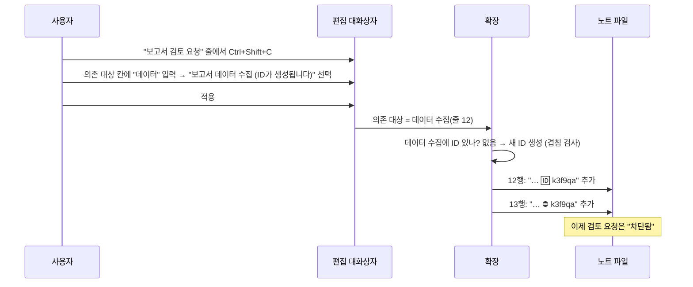
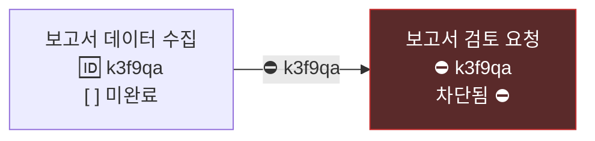
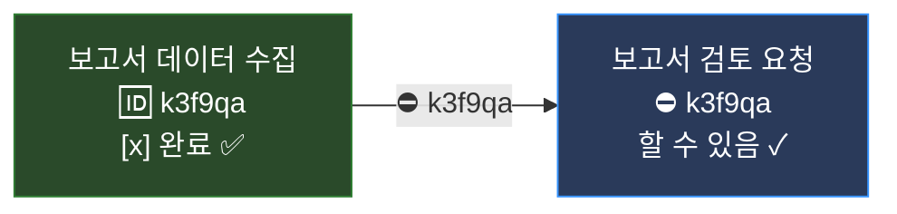
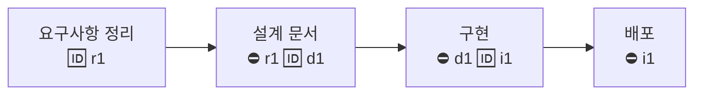
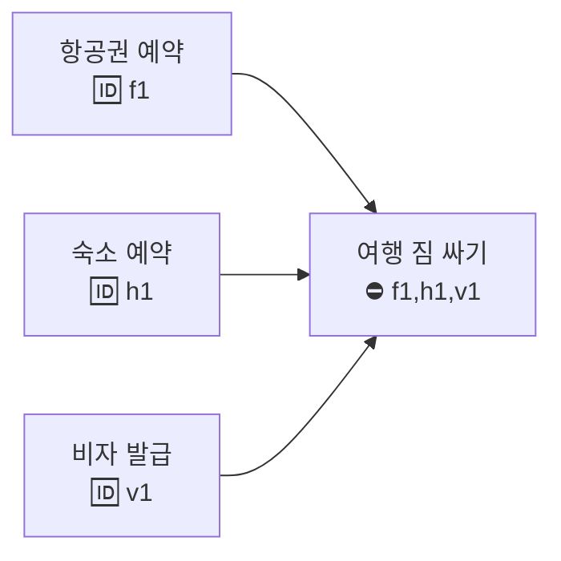
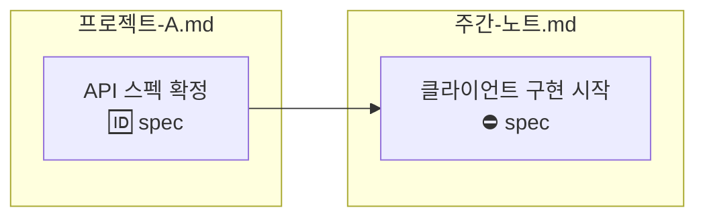
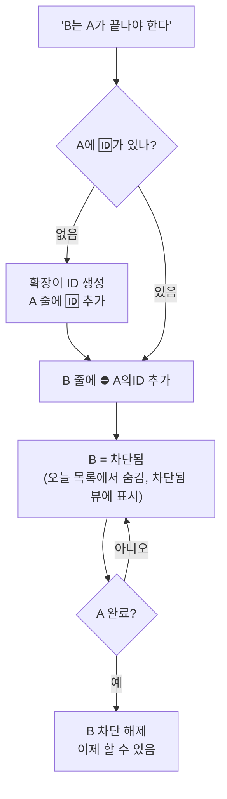

# 의존성(🆔 / ⛔) 이해하기

"A가 끝나야 B를 할 수 있다"를 태스크에 적는 기능입니다. 두 이모지만 알면 됩니다.

| 이모지 | 뜻 | 누구 줄에 붙나 |
|---|---|---|
| 🆔 `abc123` | 이 태스크의 이름표(ID) | **기다림을 받는** 쪽(먼저 끝나야 하는 일) |
| ⛔ `abc123` | "abc123이 끝나야 나를 할 수 있다" | **기다리는** 쪽(나중에 할 일) |

ID는 이름표일 뿐이고, ⛔가 그 이름표를 가리킬 때 비로소 의미가 생깁니다.

---

## 1. 자동 생성이 어떻게 일어나나 — 한 번 따라가기

노트에 두 줄이 있다고 합시다. 아직 아무 ID도 없습니다.

```markdown
- [ ] 보고서 데이터 수집 #업무 📅 2026-09-23
- [ ] 보고서 검토 요청 #업무 📅 2026-09-26
```

"검토 요청"은 "데이터 수집"이 끝나야 할 수 있습니다. 이걸 적으려면:

1. **기다리는 쪽**인 `보고서 검토 요청` 줄에 커서를 두고 `Ctrl+Shift+C`를 누릅니다(편집 대화상자).
2. 대화상자 아래쪽 **"의존 대상"** 칸에 `데이터`라고 칩니다. 워크스페이스의 태스크 목록이 걸러져 나오고, `보고서 데이터 수집`이 보입니다. 옆에 회색으로 **"(ID가 생성됩니다)"**라고 적혀 있습니다. 상대에게 아직 ID가 없다는 뜻입니다.
3. 그 항목을 클릭하고 **적용**을 누릅니다.

이때 확장이 **두 줄을 동시에** 고칩니다.

```markdown
- [ ] 보고서 데이터 수집 #업무 🆔 data1 📅 2026-09-23      ← 여기에 🆔가 "생성"되어 붙음
- [ ] 보고서 검토 요청 #업무 ⛔ data1 📅 2026-09-26        ← 여기에 ⛔가 붙음
```

즉 "자동 생성"이란: 사용자는 **누구를 기다릴지만 고르고**, ID 문자열을 지어내고 상대 줄에 써 넣고 내 줄에 ⛔를 붙이는 일은 확장이 한다는 뜻입니다. 실제 ID는 `k3f9qa`처럼 6자리 임의 문자열이고(위 예의 `data1`은 설명용), 워크스페이스 안에서 겹치지 않는지 확인해서 만듭니다.

상대에게 이미 ID가 있으면 새로 만들지 않고 그 ID를 ⛔에 씁니다. 그래서 한 태스크를 여러 태스크가 기다려도 ID는 하나입니다.



---

## 2. 그 뒤에 무슨 일이 생기나



- **차단됨 표시**: 검토 요청 줄 끝에 `⛔ 대기 중 (1)`이 나타나고, 사이드바 **차단됨** 뷰에 들어갑니다. 오늘 할 일 목록을 `is not blocked`로 거르면 이 줄은 빠집니다. "아직 할 수 없는 일"이 눈앞에서 사라지는 것이 핵심 효과입니다.
- **선행 완료**: 데이터 수집을 `[x]`로 완료하는 순간, 검토 요청의 차단이 자동으로 풀립니다. 아무것도 지울 필요가 없습니다. ⛔는 그대로 남아 "이력"이 됩니다.



---

## 3. 잘 쓰는 패턴

### 패턴 A. 순서가 정해진 일 (사슬)


- 지금 할 수 있는 것은 항상 **차단되지 않은 맨 앞 하나**뿐입니다. 사이드바 "오늘"에 네 개가 다 뜨지 않고 "요구사항 정리"만 남으니, 무엇부터 할지 고민이 없어집니다.
- 하나를 끝내면 다음 것이 자동으로 나타납니다.

### 패턴 B. 여러 조건이 모여야 되는 일 (합류)


- `⛔ f1,h1,v1`처럼 쉼표로 여러 ID를 적으면 **전부** 끝나야 풀립니다. 대화상자에서는 의존 대상을 여러 개 고르면 됩니다.
- 상태바나 `⛔ 대기 중 (2)` 표시로 몇 개가 남았는지 보입니다.

### 패턴 C. 파일이 달라도 됩니다


- 들여쓰기(하위 항목)는 같은 파일 안에서만 되지만, ID는 워크스페이스 전체에서 유일하므로 파일을 넘나듭니다. 프로젝트 노트의 결정이 나야 주간 노트의 일을 시작할 수 있을 때 씁니다.

### 패턴 D. 병목 찾기

무엇을 먼저 해야 다른 일이 풀리는지 보려면:
```tasks
not done
is blocking
sort by urgency
```
"이 태스크를 끝내면 기다리는 일이 풀린다"는 것만 나옵니다. 반대로 지금 손댈 수 있는 것만 보려면 `is not blocked`, 기다리는 중인 것만 보려면 `is blocked`.

### 패턴 E. 반복 태스크와 함께

"매주 데이터 수집(🔁 every week, 🆔 k3f9qa)"이 있고 "검토 요청"이 그것을 기다린다면, 데이터 수집을 완료할 때 생기는 다음 주 회차가 **같은 ID를 물려받습니다**(설정 `tasksmd.recurrence.idHandling`의 기본 `keep`). 그래서 검토 요청은 매주 새 회차를 자동으로 기다립니다. 매번 새 ID를 받게 하려면 `new`, ID를 빼려면 `remove`.

---

## 4. 하지 말아야 할 것

- **모든 태스크에 ID 붙이기.** 필요 없습니다. 기다리는 일이 실제로 있을 때 대화상자로 걸면 그때 붙습니다. 줄이 지저분해지고 관리만 늘어납니다.
- **없는 ID를 가리키기.** `⛔ xyz`라고 썼는데 `🆔 xyz`가 어디에도 없으면 차단되지 않은 것으로 취급되고, 에디터가 "알 수 없는 의존 대상" 경고와 함께 "의존 제거" 빠른 수정을 제안합니다.
- **서로 기다리기.** A가 B를, B가 A를 기다리면 둘 다 영원히 차단됩니다. 에디터가 "순환 의존" 오류로 잡아 줍니다.
- **들여쓰기로 의존을 표현했다고 생각하기.** 하위 항목은 구조일 뿐 의존이 아닙니다(Obsidian도 같음). 순서를 강제하려면 ⛔를 걸어야 합니다.

---

## 5. 한눈에 보는 요약



명령으로는 `Tasks: 의존성 설정`(태스크 줄에서), 대화상자에서는 "의존 대상" 칸, 직접 쓰려면 `🆔 이름`과 `⛔ 이름`, 쿼리로는 `is blocked` / `is not blocked` / `is blocking` / `has id` / `has depends on`입니다.
