# Tasks for Markdown — 설계 문서

- 문서 버전: 0.4
- 작성일: 2026-09-21
- 근거 문서: [requirements.md](requirements.md) v0.3
- 다이어그램은 Mermaid 소스와 함께 렌더링된 SVG(`imgs/`)를 나란히 둡니다. Mermaid를 렌더링하지 못하는 뷰어에서는 SVG를 보면 됩니다. UI 목업도 ASCII 원본 아래에 SVG 버전을 두었습니다.
- SVG 재생성: Mermaid는 `@mermaid-js/mermaid-cli`(`docs/imgs/README.md` 참고), UI 목업은 `docs/imgs/gen_mockups.py`.

---

## 1. 설계 목표와 원칙

| 원칙 | 설계에서의 의미 |
|---|---|
| 파일이 곧 DB | 확장은 캐시(인덱스)만 갖고, 모든 쓰기는 `.md` 줄 치환으로 끝난다. 인덱스는 언제든 버리고 다시 만들 수 있다. |
| Obsidian Tasks 문법 호환 | 파서·직렬화·쿼리 문법은 원본 테스트 케이스를 그대로 통과하는 것을 목표로 한다. |
| 네이티브 에디터 유지 | 에디터 안에서는 Decoration/CodeLens/Hover/Completion만 쓰고, 풍부한 UI는 미리보기·사이드바·웹뷰로 뺀다. |
| Core는 VS Code를 모른다 | `src/core/`는 `vscode` 모듈을 import하지 않는다. → Vitest로 빠르게 테스트, 이후 MCP 서버(v1.x) 재사용. |
| 단방향 데이터 흐름 | 파일 → 인덱스 → 뷰. 뷰는 인덱스를 직접 수정하지 않고 항상 "명령 → 파일 편집"을 거친다. |
| VS Code·Cursor 동시 지원 | Proposed API와 Copilot 전용 API(Chat Participant)는 쓰지 않는다. |

---

## 2. 시스템 컨텍스트

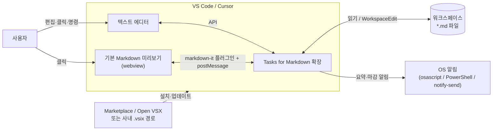
```mermaid
flowchart LR
    U[사용자]
    subgraph IDE["VS Code / Cursor"]
        EXT["Tasks for Markdown 확장"]
        MDP["기본 Markdown 미리보기<br/>(webview)"]
        ED["텍스트 에디터"]
    end
    FS[("워크스페이스<br/>*.md 파일")]
    OS["OS 알림<br/>(osascript / PowerShell / notify-send)"]
    MKT["Marketplace / Open VSX<br/>또는 사내 .vsix 경로"]

    U -->|편집·클릭·명령| ED
    U -->|클릭| MDP
    ED <-->|API| EXT
    MDP <-->|markdown-it 플러그인 + postMessage| EXT
    EXT <-->|읽기 / WorkspaceEdit| FS
    EXT -->|요약·마감 알림| OS
    MKT -->|설치·업데이트| IDE
```



---

## 3. 아키텍처 개요

### 3.1 레이어 구조

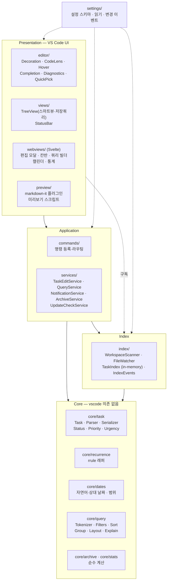
```mermaid
flowchart TB
    subgraph L4["Presentation — VS Code UI"]
        direction LR
        EDI["editor/<br/>Decoration · CodeLens · Hover<br/>Completion · Diagnostics · QuickPick"]
        VIEWS["views/<br/>TreeView(스마트뷰·저장쿼리)<br/>StatusBar"]
        WV["webviews/ (Svelte)<br/>편집 모달 · 칸반 · 쿼리 빌더<br/>캘린더 · 통계"]
        PRV["preview/<br/>markdown-it 플러그인<br/>미리보기 스크립트"]
    end
    subgraph L3["Application"]
        direction LR
        CMD["commands/<br/>명령 등록·라우팅"]
        SVC["services/<br/>TaskEditService · QueryService<br/>NotificationService · ArchiveService<br/>UpdateCheckService"]
    end
    subgraph L2["Index"]
        IDX["index/<br/>WorkspaceScanner · FileWatcher<br/>TaskIndex (in-memory) · IndexEvents"]
    end
    subgraph L1["Core — vscode 의존 없음"]
        direction LR
        TASK["core/task<br/>Task · Parser · Serializer<br/>Status · Priority · Urgency"]
        REC["core/recurrence<br/>rrule 래퍼"]
        DATE["core/dates<br/>자연어·상대 날짜 · 범위"]
        QRY["core/query<br/>Tokenizer · Filters · Sort<br/>Group · Layout · Explain"]
        ARCH["core/archive · core/stats<br/>순수 계산"]
    end
    SET["settings/<br/>설정 스키마 · 읽기 · 변경 이벤트"]

    L4 --> L3
    L3 --> L2
    L3 --> L1
    L2 --> L1
    L4 -.구독.-> L2
    SET -.-> L2
    SET -.-> L3
    SET -.-> L4
```

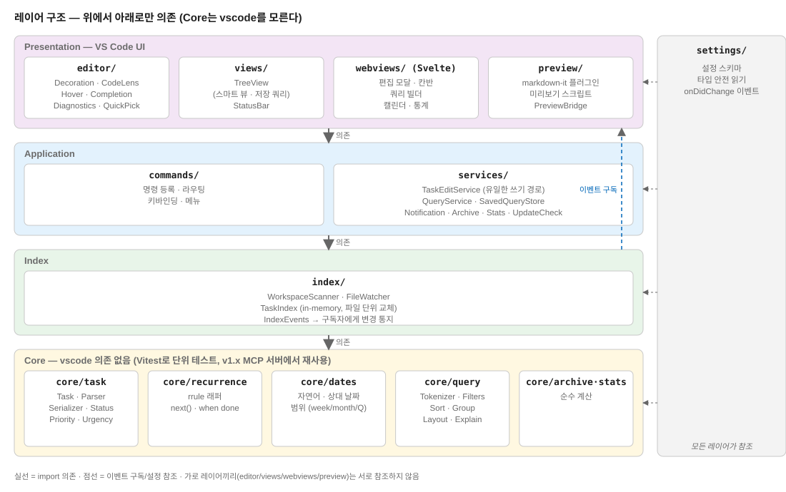

**의존성 규칙**

- `core/*` → 외부 라이브러리(dayjs, rrule, chrono-node)만 의존. `vscode` import 금지 (ESLint `no-restricted-imports`로 강제).
- `index/` → `core/` + `vscode` (파일 시스템·워처).
- `services/` → `index/` + `core/` + `vscode`. 파일 쓰기는 **오직 `TaskEditService`** 를 통해서만 한다.
- `editor/`, `views/`, `webviews/`, `preview/` → `services/`를 호출하고 `index/` 이벤트를 구독한다. 서로 직접 참조하지 않는다.

### 3.2 모듈(디렉토리) 구조

```
src/
├── extension.ts                # activate(): 아래 모듈들을 조립(composition root)
├── core/                       # ── vscode 의존 없음 ──
│   ├── task/
│   │   ├── Task.ts             # 불변 Task 모델 + 파생 값(isDone, isBlocked…)
│   │   ├── TaskParser.ts       # 한 줄 → Task | null (이모지 + Dataview)
│   │   ├── TaskSerializer.ts   # Task → 한 줄 (포맷 선택)
│   │   ├── Status.ts           # Status, StatusType, StatusRegistry, 프리셋
│   │   ├── Priority.ts
│   │   ├── DateField.ts        # { raw, valid, date }
│   │   ├── Urgency.ts
│   │   └── formats/            # emoji.ts, dataview.ts (필드 정규식·직렬화 규칙)
│   ├── recurrence/
│   │   ├── Recurrence.ts       # 규칙 파싱, next() 계산, when done
│   │   └── OnCompletion.ts
│   ├── dates/
│   │   ├── DateParser.ts       # "tomorrow", "next mon", "in 3 days" → Date
│   │   ├── DateRange.ts        # this week / 2026-W38 / 2026-Q3 …
│   │   └── Relative.ts         # "3일 남음" / "in 3 days" 표기 (i18n 키 반환)
│   ├── query/
│   │   ├── Query.ts            # 텍스트 → { filters, sorters, groupers, limit, layout, errors }
│   │   ├── Tokenizer.ts        # 줄 분리, 주석, 줄 연속, 플레이스홀더
│   │   ├── filters/            # 명령어 하나 = 파일 하나 (DueDateFilter.ts …)
│   │   ├── BooleanExpr.ts      # AND/OR/NOT/XOR + 괄호
│   │   ├── sorting/ grouping/
│   │   ├── QueryResult.ts      # 그룹 트리 + 태스크 목록
│   │   └── Explain.ts
│   ├── archive/ArchivePlanner.ts
│   └── stats/WeeklyStats.ts
├── index/
│   ├── TaskIndex.ts            # Map<path, FileEntry>, 전체 Task 배열, ID 맵
│   ├── WorkspaceScanner.ts     # findFiles + 청크 읽기
│   ├── FileWatcher.ts          # FileSystemWatcher + onDidChangeTextDocument
│   └── IndexEvents.ts          # EventEmitter<IndexChange>
├── services/
│   ├── TaskEditService.ts      # 유일한 쓰기 경로: toggle, setField, replaceLine, insertLine
│   ├── QueryService.ts         # 인덱스 위에서 쿼리 실행 + 결과 캐시
│   ├── SavedQueryStore.ts      # settings + .tasks/queries/*.md
│   ├── NotificationService.ts  # 토스트 + OS 알림, 스누즈(globalState)
│   ├── ArchiveService.ts
│   ├── StatsService.ts
│   └── UpdateCheckService.ts
├── editor/
│   ├── TaskDecorations.ts
│   ├── TaskCodeLensProvider.ts
│   ├── TaskHoverProvider.ts
│   ├── TaskCompletionProvider.ts
│   ├── TaskDiagnostics.ts
│   └── quickpicks/             # StatusPick, PriorityPick, DatePick, RecurrencePick, DependencyPick
├── preview/
│   ├── markdownItPlugin.ts     # 태스크 줄 뱃지 렌더 + ```tasks 블록 → placeholder
│   ├── previewScript.ts        # 웹뷰 측: 체크박스 클릭, 쿼리 결과 요청
│   └── PreviewBridge.ts        # 확장 측: 메시지 처리
├── views/
│   ├── TaskTreeProvider.ts     # 스마트 뷰 + 그룹 전환 + 체크박스
│   ├── SavedQueryTreeProvider.ts
│   └── StatusBar.ts
├── webviews/                   # Svelte 앱들 (별도 esbuild 엔트리)
│   ├── shared/                 # 메시지 타입, 디자인 토큰, 컴포넌트
│   ├── edit-modal/
│   ├── kanban/
│   ├── query-builder/
│   ├── calendar/
│   └── stats/
├── commands/
│   └── registerCommands.ts
├── settings/
│   └── Settings.ts             # 타입 안전 설정 접근 + onDidChange
└── l10n/                       # bundle.l10n.json, bundle.l10n.ko.json
```

---

## 4. 도메인 모델

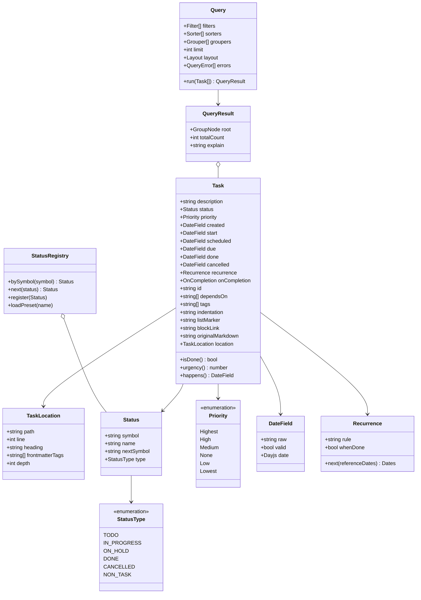
```mermaid
classDiagram
    class Task {
        +string description
        +Status status
        +Priority priority
        +DateField created
        +DateField start
        +DateField scheduled
        +DateField due
        +DateField done
        +DateField cancelled
        +Recurrence recurrence
        +OnCompletion onCompletion
        +string id
        +string[] dependsOn
        +string[] tags
        +string indentation
        +string listMarker
        +string blockLink
        +string originalMarkdown
        +TaskLocation location
        +isDone() bool
        +urgency() number
        +happens() DateField
    }
    class TaskLocation {
        +string path
        +int line
        +string heading
        +string[] frontmatterTags
        +int depth
    }
    class Status {
        +string symbol
        +string name
        +string nextSymbol
        +StatusType type
    }
    class StatusType {
        <<enumeration>>
        TODO
        IN_PROGRESS
        ON_HOLD
        DONE
        CANCELLED
        NON_TASK
    }
    class StatusRegistry {
        +bySymbol(symbol) Status
        +next(status) Status
        +register(Status)
        +loadPreset(name)
    }
    class Priority {
        <<enumeration>>
        Highest
        High
        Medium
        None
        Low
        Lowest
    }
    class DateField {
        +string raw
        +bool valid
        +Dayjs date
    }
    class Recurrence {
        +string rule
        +bool whenDone
        +next(referenceDates) Dates
    }
    class Query {
        +Filter[] filters
        +Sorter[] sorters
        +Grouper[] groupers
        +int limit
        +Layout layout
        +QueryError[] errors
        +run(Task[]) QueryResult
    }
    class QueryResult {
        +GroupNode root
        +int totalCount
        +string explain
    }
    Task --> TaskLocation
    Task --> Status
    Task --> Priority
    Task --> DateField
    Task --> Recurrence
    Status --> StatusType
    StatusRegistry o-- Status
    Query --> QueryResult
    QueryResult o-- Task
```



**Task는 불변(immutable)** 이다. 변경은 `TaskBuilder`/`with*()`로 새 객체를 만들고, 직렬화해서 파일에 쓴 뒤, 파일 변경 이벤트로 인덱스가 다시 파싱한다. 즉 "메모리에서 바꾼 Task"가 진실이 되는 순간은 없다.

### 4.1 한 줄의 해부

```
  - [ ] 보고서 작성 #work 🆔 a1b2c3 ⏫ 🔁 every week 🛫 2026-09-20 ⏳ 2026-09-22 📅 2026-09-25 ^blk1
  │ │ │ └───────┬────────┘ └──┬──┘ └┬┘ └─────┬──────┘ └─────┬──────┘ └─────┬──────┘ └─────┬──────┘ └─┬─┘
  │ │ │   description        id   priority recurrence     start        scheduled      due      blockLink
  │ │ └ status.symbol (" ")
  │ └ listMarker ("-")
  └ indentation ("  ")
```

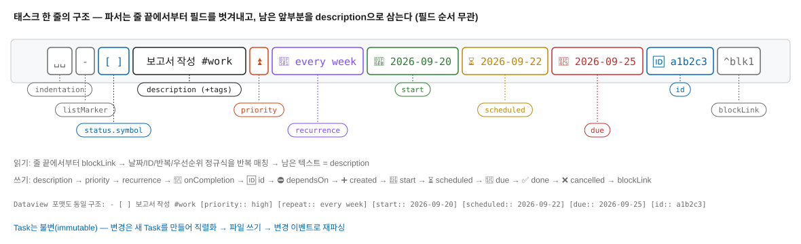

파서는 **줄 끝에서부터** 필드 정규식을 반복 적용해 벗겨내고, 남은 앞부분을 description으로 삼는다(Obsidian Tasks와 동일 전략 — 필드 순서에 무관, 필드 사이에 낀 태그는 description으로 되돌린다). 직렬화는 항상 Obsidian과 같은 고정 순서 `🆔 → ⛔ → 우선순위 → 🔁 → 🏁 → ➕ → 🛫 → ⏳ → 📅 → ❌ → ✅ → ^blockLink` 로 쓴다.

---

## 5. 데이터 흐름

### 5.1 인덱싱 파이프라인

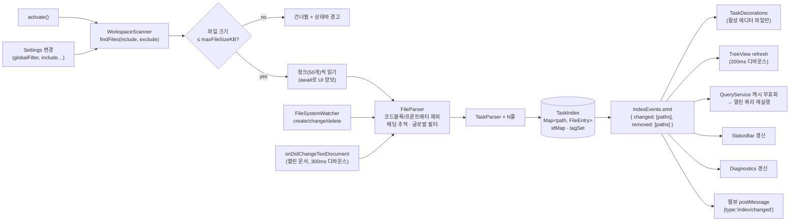
```mermaid
flowchart LR
    A["activate()"] --> B["WorkspaceScanner<br/>findFiles(include, exclude)"]
    B --> C{"파일 크기<br/>≤ maxFileSizeKB?"}
    C -- no --> SKIP["건너뜀 + 상태바 경고"]
    C -- yes --> D["청크(50개)씩 읽기<br/>(await로 UI 양보)"]
    D --> E["FileParser<br/>코드블록/프론트매터 제외<br/>헤딩 추적 · 글로벌 필터"]
    E --> F["TaskParser × N줄"]
    F --> G[("TaskIndex<br/>Map&lt;path, FileEntry&gt;<br/>idMap · tagSet")]
    G --> H["IndexEvents.emit<br/>{ changed: [paths], removed: [paths] }"]

    W1["FileSystemWatcher<br/>create/change/delete"] --> E
    W2["onDidChangeTextDocument<br/>(열린 문서, 300ms 디바운스)"] --> E
    W3["Settings 변경<br/>(globalFilter, include…)"] --> B

    H --> S1["TaskDecorations<br/>(활성 에디터 파일만)"]
    H --> S2["TreeView refresh<br/>(200ms 디바운스)"]
    H --> S3["QueryService 캐시 무효화<br/>→ 열린 쿼리 재실행"]
    H --> S4["StatusBar 갱신"]
    H --> S5["Diagnostics 갱신"]
    H --> S6["웹뷰 postMessage<br/>{type:'index/changed'}"]
```



- 열린 문서는 디스크가 아닌 `TextDocument.getText()`가 진실이다(저장 전 편집 반영).
- `FileEntry = { version, tasks: Task[], headings, mtime }`. 파일 단위로 통째로 교체하므로 부분 갱신 버그가 없다.

### 5.2 태스크 토글 (사이드바 체크박스 → 파일 → 뷰)

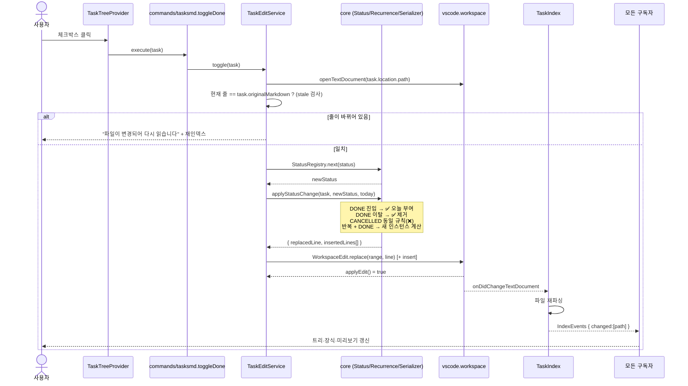
```mermaid
sequenceDiagram
    actor U as 사용자
    participant TV as TaskTreeProvider
    participant CMD as commands/tasksmd.toggleDone
    participant ES as TaskEditService
    participant CORE as core (Status/Recurrence/Serializer)
    participant VS as vscode.workspace
    participant IDX as TaskIndex
    participant Views as 모든 구독자

    U->>TV: 체크박스 클릭
    TV->>CMD: execute(task)
    CMD->>ES: toggle(task)
    ES->>VS: openTextDocument(task.location.path)
    ES->>ES: 현재 줄 == task.originalMarkdown ? (stale 검사)
    alt 줄이 바뀌어 있음
        ES-->>U: "파일이 변경되어 다시 읽습니다" + 재인덱스
    else 일치
        ES->>CORE: StatusRegistry.next(status)
        CORE-->>ES: newStatus
        ES->>CORE: applyStatusChange(task, newStatus, today)
        Note over CORE: DONE 진입 → ✅ 오늘 부여<br/>DONE 이탈 → ✅ 제거<br/>CANCELLED 동일 규칙(❌)<br/>반복 + DONE → 새 인스턴스 계산
        CORE-->>ES: { replacedLine, insertedLines[] }
        ES->>VS: WorkspaceEdit.replace(range, line) [+ insert]
        VS-->>ES: applyEdit() = true
        VS-->>IDX: onDidChangeTextDocument
        IDX->>IDX: 파일 재파싱
        IDX-->>Views: IndexEvents { changed:[path] }
        Views-->>U: 트리·장식·미리보기 갱신
    end
```

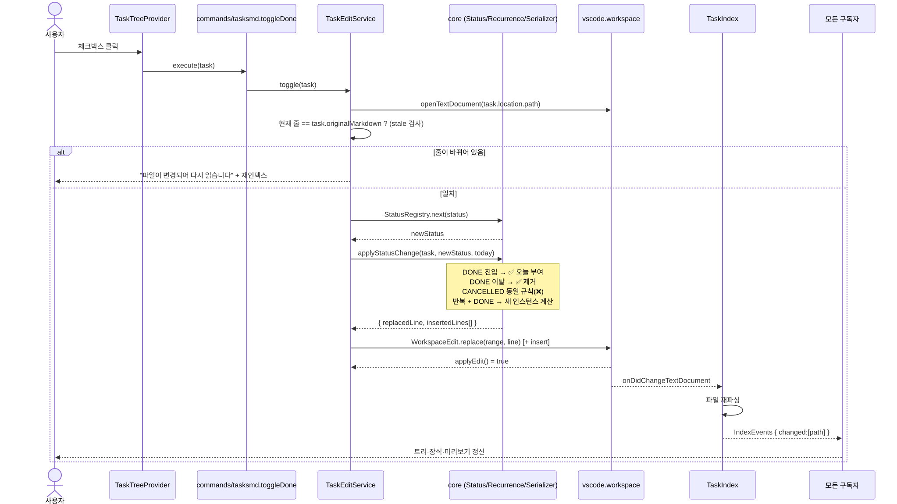

핵심: **뷰는 인덱스를 직접 건드리지 않는다.** 결과는 항상 파일 변경 이벤트를 거쳐 돌아온다. 이 덕분에 Undo(Cmd+Z)가 자연스럽게 동작하고, 미리보기·사이드바·에디터가 항상 같은 상태를 본다.

### 5.3 반복 태스크 완료

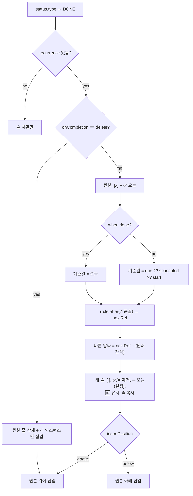
```mermaid
flowchart TD
    A["status.type → DONE"] --> B{"recurrence 있음?"}
    B -- no --> Z["줄 치환만"]
    B -- yes --> C{"onCompletion == delete?"}
    C -- yes --> D["원본 줄 삭제 + 새 인스턴스만 삽입"]
    C -- no --> E["원본: [x] + ✅ 오늘"]
    E --> F{"when done?"}
    F -- yes --> G["기준일 = 오늘"]
    F -- no --> H["기준일 = due ?? scheduled ?? start"]
    G --> I["rrule.after(기준일) → nextRef"]
    H --> I
    I --> J["다른 날짜 = nextRef + (원래 간격)"]
    J --> K["새 줄: [ ], ✅/❌ 제거, ➕ 오늘(설정),<br/>🆔 유지, ⛔ 복사"]
    K --> L{"insertPosition"}
    L -- above --> M["원본 위에 삽입"]
    L -- below --> N["원본 아래 삽입"]
    D --> M
```



### 5.4 쿼리 실행 파이프라인

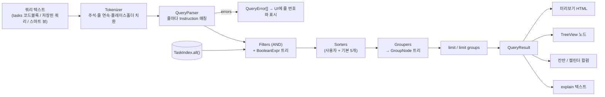
```mermaid
flowchart LR
    Q["쿼리 텍스트<br/>(tasks 코드블록 / 저장된 쿼리 / 스마트 뷰)"] --> T["Tokenizer<br/>주석·줄 연속·플레이스홀더 치환"]
    T --> P["QueryParser<br/>줄마다 Instruction 매칭"]
    P --> |errors| ERR["QueryError[] → UI에 줄 번호와 표시"]
    P --> F["Filters (AND)<br/>+ BooleanExpr 트리"]
    IDX[("TaskIndex.all()")] --> F
    F --> S["Sorters<br/>(사용자 + 기본 5개)"]
    S --> G["Groupers<br/>→ GroupNode 트리"]
    G --> L["limit / limit groups"]
    L --> R["QueryResult"]
    R --> V1["미리보기 HTML"]
    R --> V2["TreeView 노드"]
    R --> V3["칸반 / 캘린더 컬럼"]
    R --> X["explain 텍스트"]
```



- `filter/sort/group by function`은 `query.allowFunctions && workspace.isTrusted`일 때만 컴파일한다. 함수는 `new Function('task','query', ...)`로 만들고, 예외는 해당 태스크만 제외하고 오류 목록에 누적한다.
- `QueryService`는 `(queryText, indexVersion)`을 키로 결과를 캐시한다. 인덱스 이벤트마다 무효화된다.

### 5.5 미리보기 브리지

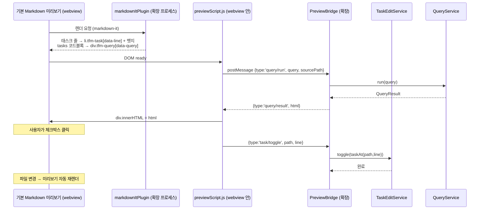
```mermaid
sequenceDiagram
    participant MD as 기본 Markdown 미리보기 (webview)
    participant MIP as markdownItPlugin (확장 프로세스)
    participant PS as previewScript.js (webview 안)
    participant PB as PreviewBridge (확장)
    participant ES as TaskEditService
    participant QS as QueryService

    MD->>MIP: 렌더 요청 (markdown-it)
    MIP-->>MD: 태스크 줄 → li.tfm-task[data-line] + 뱃지<br/>tasks 코드블록 → div.tfm-query[data-query]
    MD->>PS: DOM ready
    PS->>PB: postMessage {type:'query/run', query, sourcePath}
    PB->>QS: run(query)
    QS-->>PB: QueryResult
    PB-->>PS: {type:'query/result', html}
    PS->>MD: div.innerHTML = html
    Note over MD: 사용자가 체크박스 클릭
    PS->>PB: {type:'task/toggle', path, line}
    PB->>ES: toggle(taskAt(path,line))
    ES-->>PB: 완료
    Note over MD: 파일 변경 → 미리보기 자동 재렌더
```

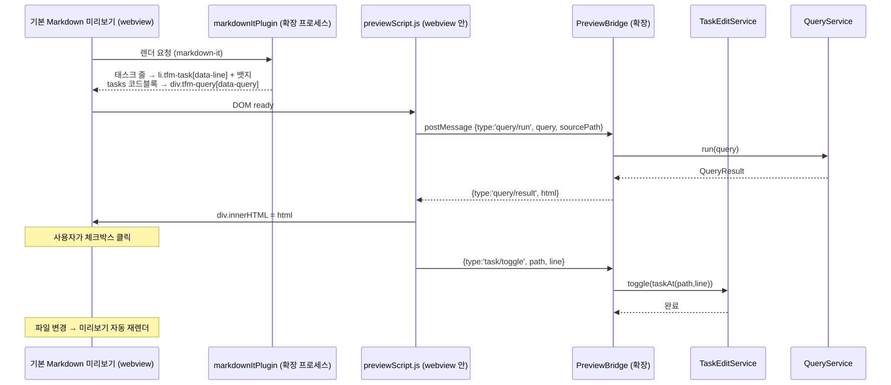

**M5.0 스파이크 결과(D-1)**: 위 시퀀스의 `postMessage`/`query/run` 경로는 클래식 미리보기에서 **불가능**하다(기여 스크립트는 `acquireVsCodeApi` 획득 불가, `command:` 링크 비활성). 실제 구현은 렌더 시점 통합이다 — markdown-it 플러그인이 확장 프로세스에서 `QueryService`를 직접 호출해 결과 HTML을 만들고, 인덱스 변경 시 `markdown.preview.refresh`를 호출한다. 체크박스는 표시 전용이며 토글은 사이드바/칸반/에디터에서 한다. 상호작용형 미리보기는 VS Code의 새 Markdown Editor + `codeBlockEditors`(v1.x 후보)로 가능하다.

### 5.6 웹뷰 메시지 프로토콜 (모든 Svelte 앱 공통)

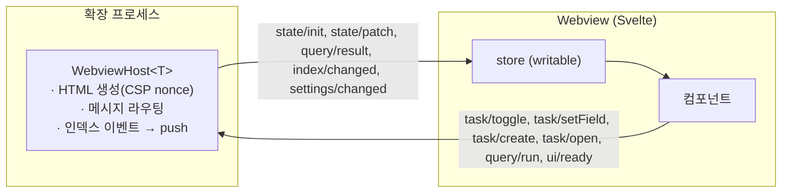
```mermaid
flowchart LR
    subgraph EXT["확장 프로세스"]
        HOST["WebviewHost&lt;T&gt;<br/>· HTML 생성(CSP nonce)<br/>· 메시지 라우팅<br/>· 인덱스 이벤트 → push"]
    end
    subgraph WV["Webview (Svelte)"]
        STORE["store (writable)"]
        UI["컴포넌트"]
    end
    HOST -- "state/init, state/patch, query/result, index/changed, settings/changed" --> STORE
    STORE --> UI
    UI -- "task/toggle, task/setField, task/create, task/open, query/run, ui/ready" --> HOST
```



| 방향 | 메시지 | 용도 |
|---|---|---|
| ext → wv | `state/init { tasks, settings, l10n }` | 최초 로드 |
| ext → wv | `state/patch { changedPaths, tasks }` | 인덱스 부분 갱신 |
| ext → wv | `query/result { requestId, result }` | 쿼리 응답 |
| wv → ext | `task/toggle { path, line }` | 상태 순환 |
| wv → ext | `task/setField { path, line, field, value }` | 드래그앤드롭·폼 적용 |
| wv → ext | `task/create { path, line, task }` | 새 태스크 |
| wv → ext | `task/open { path, line }` | 에디터로 이동 |
| wv → ext | `query/run { requestId, query }` | 쿼리 실행 |

메시지 타입은 `webviews/shared/protocol.ts`에 discriminated union으로 정의해 양쪽에서 같은 타입을 import한다.

---

## 6. 상태 머신

### 6.1 Status 전이 (기본 세트)

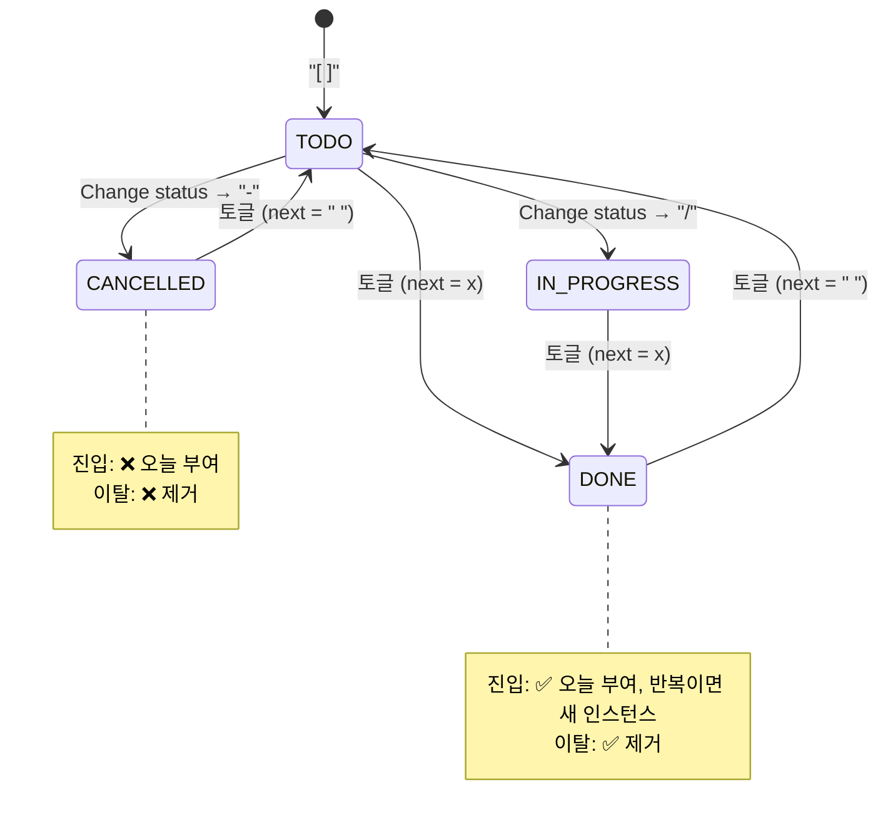
```mermaid
stateDiagram-v2
    [*] --> TODO: "[ ]"
    TODO --> DONE: 토글 (next = x)
    DONE --> TODO: 토글 (next = " ")
    TODO --> IN_PROGRESS: Change status → "/"
    IN_PROGRESS --> DONE: 토글 (next = x)
    TODO --> CANCELLED: Change status → "-"
    CANCELLED --> TODO: 토글 (next = " ")
    note right of DONE
        진입: ✅ 오늘 부여, 반복이면 새 인스턴스
        이탈: ✅ 제거
    end note
    note right of CANCELLED
        진입: ❌ 오늘 부여
        이탈: ❌ 제거
    end note
```



전이 규칙은 심볼이 아니라 **타입 변화**로 판단한다. 따라서 ITS 테마의 `[X]`, Minimal의 `[>]` 같은 커스텀 심볼도 타입만 맞으면 동일하게 동작한다.

### 6.2 인덱스 수명주기

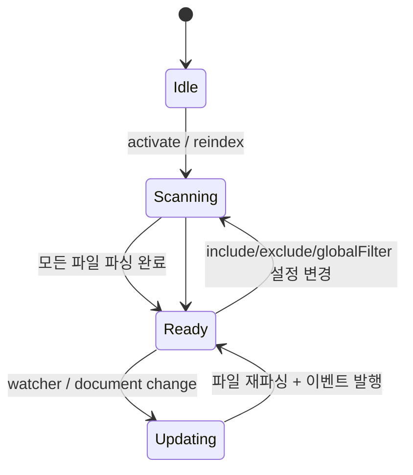
```mermaid
stateDiagram-v2
    [*] --> Idle
    Idle --> Scanning: activate / reindex
    Scanning --> Ready: 모든 파일 파싱 완료
    Ready --> Updating: watcher / document change
    Updating --> Ready: 파일 재파싱 + 이벤트 발행
    Ready --> Scanning: include/exclude/globalFilter 설정 변경
    Scanning --> Ready
```



상태바는 `Scanning` 중 진행률(`$(sync~spin) Tasks: 1,234/5,000`)을 표시한다.

---

## 7. UI 설계

### 7.1 전체 레이아웃

```
┌──┬──────────────────────┬──────────────────────────────────┬──────────────────────────┐
│A │ TASKS  (사이드바)     │ notes/week-38.md        (에디터)  │ Preview: week-38.md      │
│c ├──────────────────────┼──────────────────────────────────┼──────────────────────────┤
│t │ ▾ 스마트 뷰           │ ## 이번 주                        │ 이번 주                  │
│i │   ☐ 오늘 (4)          │                                  │ ☐ 보고서 작성  [높음]    │
│v │   ☐ 예정 7일 (12)     │  ✔ 완료 · ⏫ 높음 ▾ · 📅 9/25 ▾ · ✎ │    📅 9/25 (4일 남음) 🔁  │
│i │   ☐ 기한 초과 (2)     │ - [ ] 보고서 작성 ⏫ 📅 2026-09-25 │ ☑ 회의록 정리 ✅ 9/21    │
│t │   ☐ 진행 중 (3)       │              ⏳ 4일 남음  ← 장식   │                          │
│y │   ☐ 차단됨 (1)        │ - [x] 회의록 정리 ✅ 2026-09-21    │ ┌─ tasks 쿼리 결과 ─────┐│
│  │   ☐ 미완료 전체 (57)  │ - [ ] 배포 준비 ⛔ a1b2c3          │ │ 기한 초과 (2)         ││
│B │ ▾ 저장된 쿼리         │                                  │ │ ☐ 계약서 검토 ⚠ 2일  ││
│a │   ⚙ 이번 주 업무      │ ```tasks                         │ │ ☐ 예산안 ⚠ 5일       ││
│r │   📄 프로젝트 A       │ not done                          │ └───────────────────────┘│
│  │   + 새 쿼리…          │ due before next week              │                          │
│  │ ▾ 칸반 (WebviewView)  │ ```                               │                          │
│  │  [할 일][진행][완료]   │                                  │                          │
├──┴──────────────────────┴──────────────────────────────────┴──────────────────────────┤
│ $(checklist) 미완료 57 · 오늘 4 · 초과 2                     PROBLEMS: ⚠ 잘못된 날짜 1  │
└────────────────────────────────────────────────────────────────────────────────────────┘
```

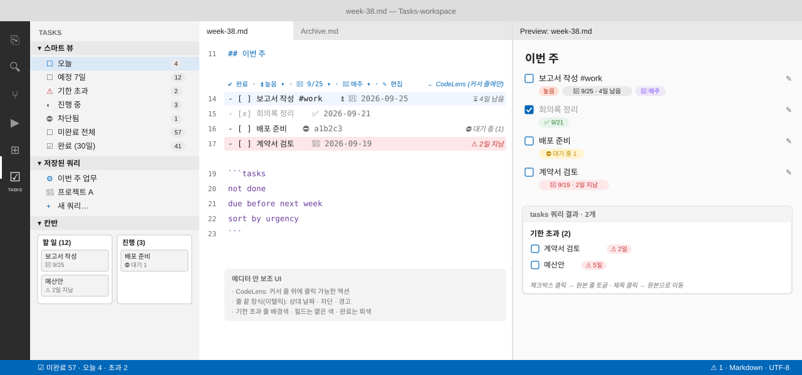

- **A**: 액티비티 바의 Tasks 아이콘. 클릭하면 세 개의 뷰(스마트 뷰 / 저장된 쿼리 / 칸반)가 한 컨테이너에 표시된다.
- **에디터**: CodeLens(커서 줄에만, 설정), 줄 끝 상대 날짜 장식, 기한 초과 줄 배경색, 필드 부분 옅은 색.
- **미리보기**: 체크박스 클릭 가능, 필드는 뱃지, ` ```tasks ` 블록은 결과 카드.
- **상태바**: 요약 + 클릭 시 사이드바 열기. Problems 패널에 진단.

### 7.2 에디터 안 상호작용 흐름

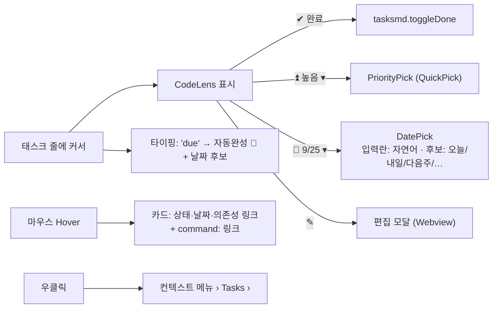
```mermaid
flowchart LR
    T["태스크 줄에 커서"] --> CL["CodeLens 표시"]
    T --> AS["타이핑: 'due' → 자동완성 📅 + 날짜 후보"]
    CL -->|"✔ 완료"| TG["tasksmd.toggleDone"]
    CL -->|"⏫ 높음 ▾"| PP["PriorityPick (QuickPick)"]
    CL -->|"📅 9/25 ▾"| DP["DatePick<br/>입력란: 자연어 · 후보: 오늘/내일/다음주/…"]
    CL -->|"✎"| EM["편집 모달 (Webview)"]
    H["마우스 Hover"] --> HC["카드: 상태·날짜·의존성 링크<br/>+ command: 링크"]
    RC["우클릭"] --> CM["컨텍스트 메뉴 › Tasks ›"]
```



### 7.3 편집 모달 (Webview)

```
┌─ Tasks: Create or edit ──────────────────────────────────────────────┐
│ 설명 (D)  [ 보고서 작성 #work                                    ]  │
│ 우선순위 (P)  ○ 최고 ● 높음 ○ 중간 ○ 없음 ○ 낮음 ○ 최저             │
│ 반복 (R)     [ every week                    ] ✓ 매주 월요일         │
│              프리셋: [매일][평일][매주][매월][매년]  □ when done      │
│ 시작 (S)     [ 2026-09-20 ] 📆    예정 (C) [ 2026-09-22 ] 📆         │
│ 마감 (U)     [ next friday ] 📆 → 2026-09-25 (금)                    │
│ ▸ 생성/완료/취소일 (접힘)                                            │
│ 상태 (T)     [ [ ] Todo ▾ ]                                          │
│ 의존성       이 태스크 전에: [ 데이터 수집 (a1b2c3) ×] [검색…      ] │
│              이 태스크 후에: [ 배포 준비 (z9y8x7)  ]                 │
│ 완료 시      ● 유지 ○ 삭제                                           │
│──────────────────────────────────────────────────────────────────────│
│ 미리보기: - [ ] 보고서 작성 #work ⏫ 🔁 every week 🛫 2026-09-20 …   │
│                                          [ 취소 (Esc) ] [ 적용 (⏎) ] │
└──────────────────────────────────────────────────────────────────────┘
```

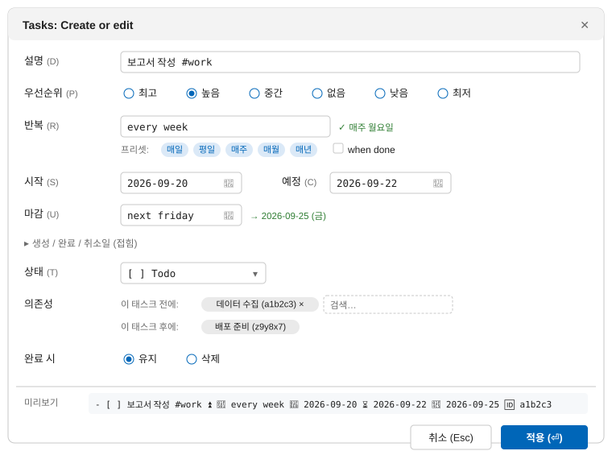

### 7.4 칸반 / 컬럼 뷰 (에디터 패널 + 사이드바 공용 컴포넌트)

```
 컬럼 기준: [상태 ▾]   데이터: [저장된 쿼리: 이번 주 업무 ▾]   그룹: [파일 ▾]   🔍
┌────────────────┬────────────────┬────────────────┬────────────────┐
│ 할 일 (12)      │ 진행 중 (3)     │ 보류 (1)        │ 완료 (8)        │
├────────────────┼────────────────┼────────────────┼────────────────┤
│ ┌────────────┐ │ ┌────────────┐ │                │ ┌────────────┐ │
│ │⏫ 보고서 작성│ │ │ 배포 준비   │ │                │ │ 회의록 정리 │ │
│ │📅 9/25 · #work│ │ │⛔ 대기 1   │ │                │ │ ✅ 9/21     │ │
│ └────────────┘ │ └────────────┘ │                │ └────────────┘ │
│ ┌────────────┐ │        ↑ 드래그: 상태 변경        │                │
│ │ 예산안 ⚠2일 │ │                │                │                │
│ └────────────┘ │                │                │                │
└────────────────┴────────────────┴────────────────┴────────────────┘
```

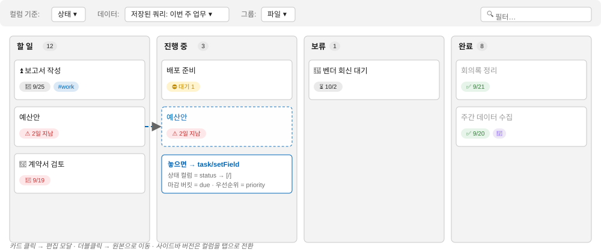

드래그 결과는 컬럼 기준에 따라 `task/setField`로 변환된다: 상태 → `status`, 마감일 버킷 → `due`, 우선순위 → `priority`. 사이드바 버전은 폭이 좁으므로 컬럼을 탭으로 전환한다.

### 7.5 캘린더 (월간 / 주간)

```
 ◀ 2026년 9월 ▶     [월간][주간]   표시: ☑📅 마감 ☑⏳ 예정 □🛫 시작   데이터: [전체 ▾]
┌──────┬──────┬──────┬──────┬──────┬──────┬──────┐
│ 월 21│ 화 22│ 수 23│ 목 24│ 금 25│ 토 26│ 일 27│
│ 오늘 │⏳보고서│      │      │📅보고서│      │      │
│📅계약⚠│      │      │      │📅예산안│      │      │
│ +2   │      │      │      │      │      │      │
├──────┼──────┼──────┼──────┼──────┼──────┼──────┤
```

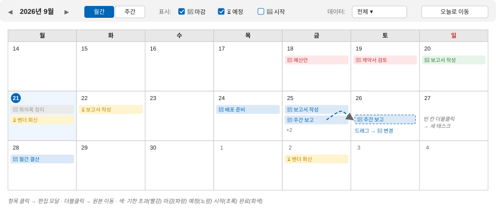

- 칸 안 항목 클릭 → 편집 모달, 드래그 → 해당 날짜 필드 변경, 빈 칸 더블클릭 → 새 태스크(마감일 채움).
- 주간 뷰는 하루를 세로로 넓게 펼쳐 항목을 모두 표시한다.

### 7.6 통계 (주 단위)

```
 최근 12주  (월요일 시작)                     필터: 태그 [#work ▾]  폴더 [전체 ▾]
 완료 ▇▇▇▇▇▇▇▇  신규 ▁▁▁▁  초과 ▂
 W27 W28 W29 W30 W31 W32 W33 W34 W35 W36 W37 W38
 ┌───────────────────────────────────────────┐
 │ 완료  12  15   9  18  20  14  11  16  19  22  17  8 (진행 중) │
 │ 신규  10  14  12  15  17  13  12  15  18  20  16  9            │
 │ 초과   1   0   2   1   3   2   1   0   1   2   1  2            │
 │ 잔량  57  56  59  56  53  52  53  52  51  49  48  49           │
 └───────────────────────────────────────────┘
 ⓘ ✅/➕ 날짜가 없는 태스크 23개는 집계에서 제외됨
```

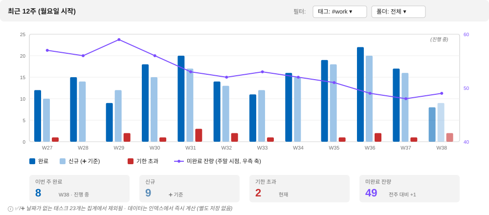

### 7.7 디자인 토큰

웹뷰는 VS Code 테마 변수(`--vscode-*`)만 사용해 라이트/다크/하이 컨트라스트를 자동 대응한다. 우선순위·기한 색은 `editor/`와 `webviews/shared/tokens.css`가 같은 매핑을 공유한다.

| 의미 | 토큰 |
|---|---|
| 기한 초과 | `--vscode-errorForeground` / 배경 `--vscode-inputValidation-errorBackground` |
| 오늘 마감 | `--vscode-editorWarning-foreground` |
| 우선순위 최고/높음 | `--vscode-charts-red` / `--vscode-charts-orange` |
| 중간/낮음/최저 | `--vscode-charts-yellow` / `--vscode-charts-blue` / `--vscode-descriptionForeground` |
| 필드(메타데이터) 텍스트 | `--vscode-descriptionForeground` |
| 완료 | `--vscode-disabledForeground` + 취소선 |

---

## 8. 저장소와 설정

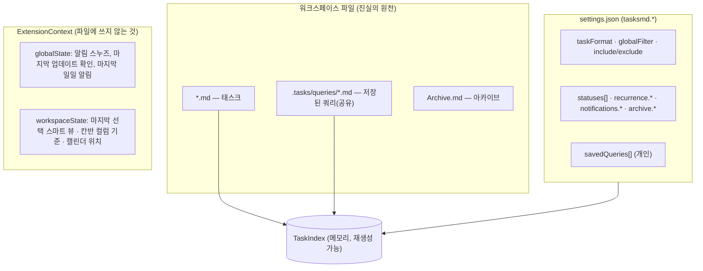
```mermaid
flowchart TB
    subgraph Files["워크스페이스 파일 (진실의 원천)"]
        MD["*.md — 태스크"]
        Q[".tasks/queries/*.md — 저장된 쿼리(공유)"]
        AR["Archive.md — 아카이브"]
    end
    subgraph Settings["settings.json (tasksmd.*)"]
        S1["taskFormat · globalFilter · include/exclude"]
        S2["statuses[] · recurrence.* · notifications.* · archive.*"]
        S3["savedQueries[] (개인)"]
    end
    subgraph State["ExtensionContext (파일에 쓰지 않는 것)"]
        GS["globalState: 알림 스누즈, 마지막 업데이트 확인, 마지막 일일 알림"]
        WS["workspaceState: 마지막 선택 스마트 뷰 · 칸반 컬럼 기준 · 캘린더 위치"]
    end
    IDX[("TaskIndex (메모리, 재생성 가능)")]
    MD --> IDX
    Q --> IDX
    Settings --> IDX
```



원칙: **파일에 넣을 가치가 있는 것(공유되어야 하는 것)만 파일에, UI 편의 상태는 `workspaceState`에.** 확장을 지워도 `.md`에는 표준 문법만 남는다.

---

## 9. 성능 설계

| 지점 | 전략 |
|---|---|
| 초기 스캔 | 50파일 청크마다 `await`로 이벤트 루프에 양보, 진행률 상태바 표시. 목표 5,000파일 < 5초 |
| 파싱 | 줄 단위 정규식 1회 통과. 태스크가 아닌 줄은 `[x]` 패턴 프리체크로 조기 탈락 |
| 문서 편집 | `onDidChangeTextDocument` 300ms 디바운스 후 해당 파일만 재파싱 |
| 장식 | 활성 에디터의 `visibleRanges` ±50줄만 계산, 100ms 디바운스 |
| CodeLens | 기본 "커서 줄에만" → 렌즈 1개 |
| 쿼리 | `(queryText, indexVersion)` 캐시. 50,000 태스크 필터 < 100ms 목표. `regex` 필터는 컴파일 1회 |
| 트리 뷰 | 그룹 노드는 lazy `getChildren`, 태스크 노드 5,000개 이상이면 "더 보기" |
| 웹뷰 | `state/patch`로 변경된 파일의 태스크만 전송. 칸반·캘린더는 가상 스크롤 |
| 메모리 | Task는 원문 문자열 + 파싱 필드만 보유(≈ 1KB). 50,000개 ≈ 50MB 상한 |

---

## 10. 보안 설계

- **Workspace Trust**: 신뢰되지 않은 워크스페이스에서는 `query.allowFunctions`를 강제 false, OS 알림(외부 프로세스 실행) 비활성, `updateCheckUrl` 무시. `capabilities.untrustedWorkspaces: { supported: 'limited' }`로 선언.
- **웹뷰 CSP**: `default-src 'none'; style-src ${cspSource} 'nonce-…'; script-src 'nonce-…'; img-src ${cspSource} data:`. 인라인 스크립트 금지, `localResourceRoots`를 `dist/webviews`로 제한.
- **쿼리 JS 함수**: `new Function`으로 생성하되 `task` 객체는 읽기 전용 프록시로 전달. 실행 시간 상한(예: 태스크당 5ms 초과 시 함수 비활성 + 경고).
- **파일 쓰기**: 줄 내용 재검증(stale 검사) 후에만 `WorkspaceEdit`. 여러 파일 동시 수정(아카이브)은 하나의 `WorkspaceEdit`로 원자적 적용.
- **OS 알림**: 셸 문자열 조립 금지, `child_process.execFile`에 인자 배열로 전달.

---

## 11. 국제화

- 확장 측 문자열: `vscode.l10n.t()` + `l10n/bundle.l10n.ko.json`. `package.json` 문자열은 `package.nls.ko.json`.
- 웹뷰: `state/init`에 현재 로케일의 번들을 실어 보내고 Svelte에서 `t(key)`로 사용.
- 상대 날짜 표기(`core/dates/Relative.ts`)는 **키와 파라미터**만 반환(`{ key: 'daysLeft', n: 3 }`)하고 렌더링 층에서 번역한다 — core가 i18n 라이브러리를 몰라도 되게.

---

## 12. 테스트 전략

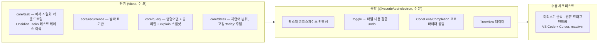
```mermaid
flowchart LR
    subgraph Unit["단위 (Vitest, 수 초)"]
        C1["core/task — 파서·직렬화 라운드트립<br/>Obsidian Tasks 테스트 케이스 이식"]
        C2["core/recurrence — 날짜 표 기반"]
        C3["core/query — 명령어별 + 불리언 + explain 스냅샷"]
        C4["core/dates — 자연어·범위, 고정 'today' 주입"]
    end
    subgraph Integ["통합 (@vscode/test-electron, 수 분)"]
        I1["픽스처 워크스페이스 인덱싱"]
        I2["toggle → 파일 내용 검증 · Undo"]
        I3["CodeLens/Completion 프로바이더 응답"]
        I4["TreeView 데이터"]
    end
    subgraph Manual["수동 체크리스트"]
        M1["미리보기 클릭 · 웹뷰 드래그앤드롭<br/>VS Code + Cursor, mac/win"]
    end
    Unit --> Integ --> Manual
```



- 모든 날짜 로직은 `now`를 주입받는다(`Clock` 인터페이스). 테스트에서 고정 날짜 사용.
- 파서 픽스처는 `tests/fixtures/*.md`에 두고 `docs/samples/`가 채워지면 그대로 추가한다.

---

## 13. 빌드·배포 파이프라인

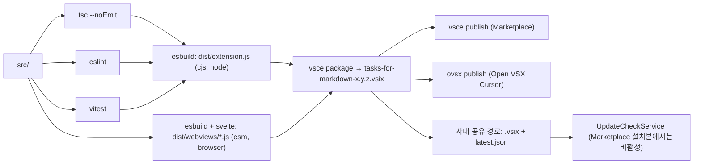
```mermaid
flowchart LR
    SRC["src/"] --> TC["tsc --noEmit"]
    SRC --> LINT["eslint"]
    SRC --> UT["vitest"]
    TC & LINT & UT --> B1["esbuild: dist/extension.js (cjs, node)"]
    SRC --> B2["esbuild + svelte: dist/webviews/*.js (esm, browser)"]
    B1 & B2 --> PKG["vsce package → tasks-for-markdown-x.y.z.vsix"]
    PKG --> M1["vsce publish (Marketplace)"]
    PKG --> M2["ovsx publish (Open VSX → Cursor)"]
    PKG --> M3["사내 공유 경로: .vsix + latest.json"]
    M3 --> UC["UpdateCheckService (Marketplace 설치본에서는 비활성)"]
```



GitHub Actions: PR마다 `typecheck + lint + test`, 태그 `v*` 푸시 시 패키징 + Release 첨부 + (시크릿 있으면) Marketplace/Open VSX 게시.

---

## 14. 마일스톤 ↔ 모듈 매핑

| 단계 | 구현 모듈 | 설계 절 |
|---|---|---|
| M0 | 스캐폴딩, `core/task`, 테스트 | 3.2, 4 |
| M1 | `index/`, `services/TaskEditService`, `views/TaskTreeProvider`, `StatusBar`, `commands` | 5.1, 5.2, 7.1 |
| M2 | `editor/*`, `core/dates` | 7.2 |
| M3 | `core/recurrence`, `Status` 프리셋, 의존성, `Urgency` | 5.3, 6.1 |
| M4 | `core/query`, `QueryService`, `SavedQueryStore`, 쿼리 빌더 웹뷰 | 5.4 |
| M5 | `preview/*` | 5.5 |
| M6 | `webviews/edit-modal`, `kanban` | 5.6, 7.3, 7.4 |
| M7 | `NotificationService`, `ArchiveService`, `stats`, `calendar` | 7.5, 7.6 |
| M8 | i18n, 성능, 패키징, 게시 | 11, 13 |

---

## 15. 열린 설계 이슈

| # | 이슈 | 결정 시점 |
|---|---|---|
| D-1 | ~~기본 미리보기 ↔ 확장 간 양방향 메시지 채널~~ → **결정(M5.0 스파이크 + 2026-09-21 재검증)**: 클래식 미리보기(`markdown.showPreview`)에는 편집에 쓸 채널이 **없다**. 기여 스크립트는 (`contributes["markdown.previewScripts"]` 평면 키로) 로드되지만 `acquireVsCodeApi`는 이미 획득되어 실패, 웹뷰에 `enableCommandUris`가 없어 `command:` 링크·커스텀 스킴 링크 불통. 유일하게 동작하는 것은 **상대 링크 클릭 → `openLink` → 마크다운 확장이 파일을 여는 것**뿐이라(실측: 링크 클릭으로 `dev-checklist.md`가 열림) 토글용으로는 부적합(가짜 파일+커스텀 에디터 트릭은 탭 깜빡임 때문에 기각). 따라서 미리보기 연동은 **렌더 시점 통합**으로 한정: markdown-it 플러그인이 확장 프로세스에서 실행되므로 태스크 뱃지와 ` ```tasks ` 결과를 렌더 시 HTML로 생성하고, 인덱스 변경 시 `markdown.preview.refresh`로 갱신. 체크박스 클릭·편집은 사이드바/칸반/에디터에서. 태스크 링크는 `file.md#L12`(`markdown.preview.openMarkdownLinks: inEditor`일 때 줄로 이동). **참고**: VS Code 1.138에는 새 내장 "Markdown Editor"(WYSIWYG 커스텀 에디터)와 `markdown.codeBlockEditors` 확장 포인트(양방향 transport)가 있어 향후 ` ```tasks ` 블록을 상호작용형으로 렌더링할 수 있음 → v1.x 후보 | 완료 |
| D-2 | ~~Cursor의 `markdown.previewScripts` 지원 여부~~ → **결정(M5.0)**: Cursor 3.12.10은 클래식 미리보기만 있고(`vscode.markdown.preview.editor`), `codeBlockEditors`/내장 Markdown Editor 없음. `markdownItPlugins`/`previewStyles`/`previewScripts` 계약은 동일 → 렌더 시점 통합이 VS Code·Cursor 공통 기준선 | 완료 |
| D-3 | ~~드래그앤드롭 라이브러리~~ → **결정(M6.3)**: 네이티브 HTML5 DnD(`dataTransfer` + `dragover/drop`), 라이브러리 없음. 카드는 `application/x-tfm-task` 페이로드로 `{key,line}` 전달, 컬럼이 `task/setField`로 변환 | 완료 |
| D-4 | `rrule` 번들 크기(≈ 60KB)와 Obsidian Tasks의 반복 파서 이식 범위 | M3 |
| D-5 | ~~OS 알림의 Linux 지원 범위~~ → **결정(M7.1)**: `notify-send`가 있으면 사용, 실패(미설치 등) 시 로그만 남기고 토스트로 대체. macOS `osascript`, Windows PowerShell 토스트 동일 정책 | 완료 |

---

## 16. 변경 이력

| 날짜 | 버전 | 내용 |
|---|---|---|
| 2026-09-21 | 0.4 | D-1 재검증: 미리보기 스크립트는 로드되나 `openLink`(파일 열기)만 통함 — 결론 유지. 기여 키는 평면 `markdown.*` 형태여야 함(중첩 시 무시) |
| 2026-09-21 | 0.3 | 4.1 직렬화 순서를 Obsidian 실제 구현에 맞춤 (id/dependsOn이 앞, cancelled가 done 앞) |
| 2026-09-21 | 0.2 | 모든 Mermaid 다이어그램과 ASCII 목업에 SVG 버전 추가 (`imgs/`) · 5.4/5.5 Mermaid 소스의 백틱 파싱 오류 수정 |
| 2026-09-21 | 0.1 | 초안 — 아키텍처, 도메인 모델, 데이터 흐름, UI 와이어프레임, 보안·성능·테스트·배포 |
